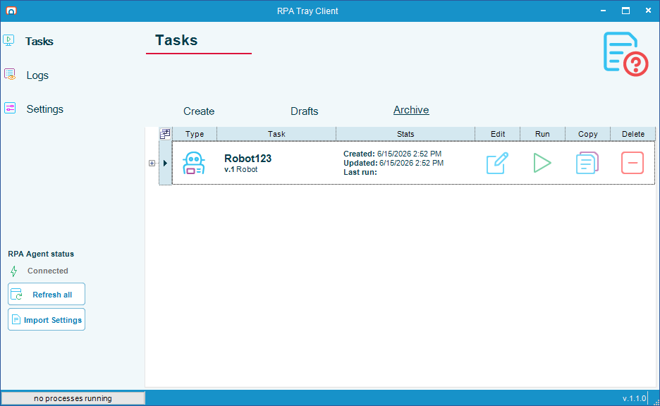
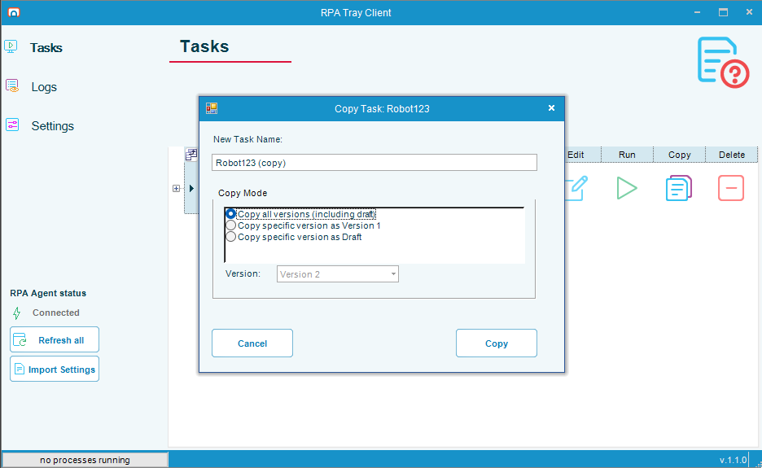
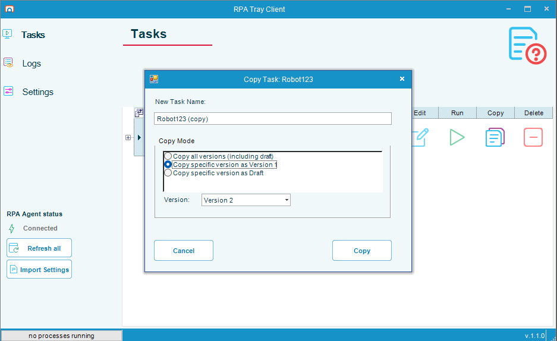
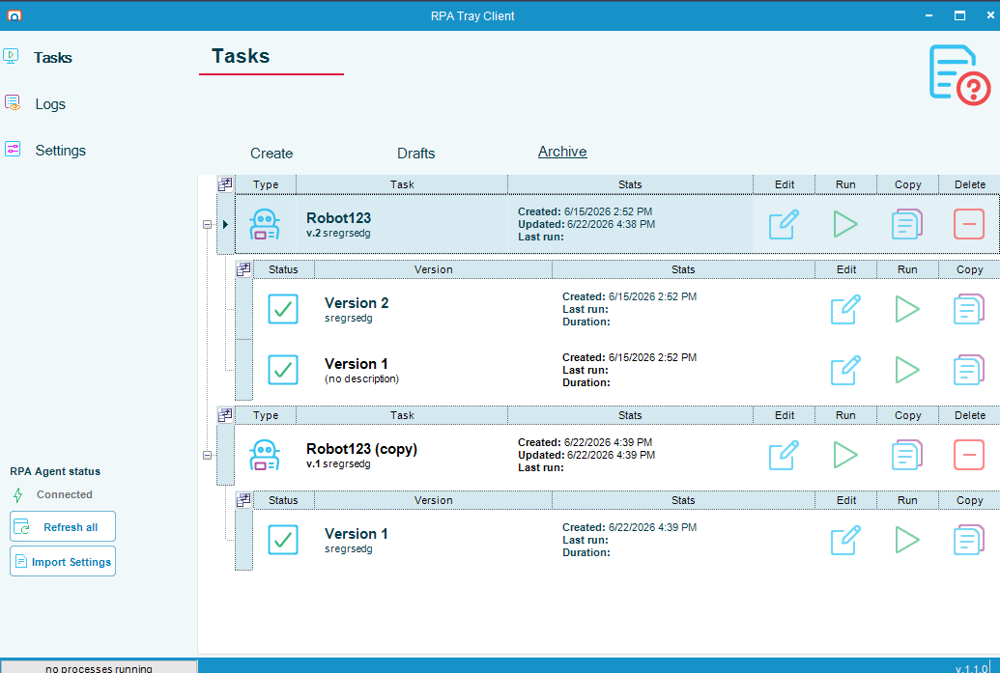
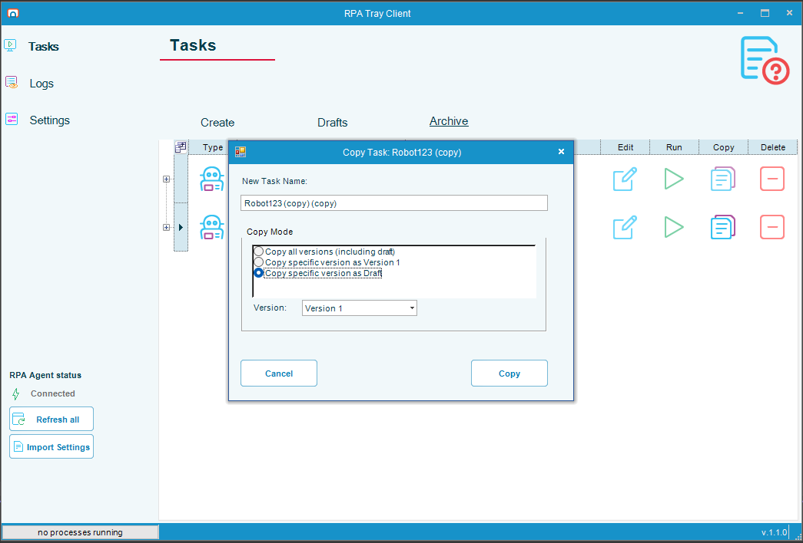
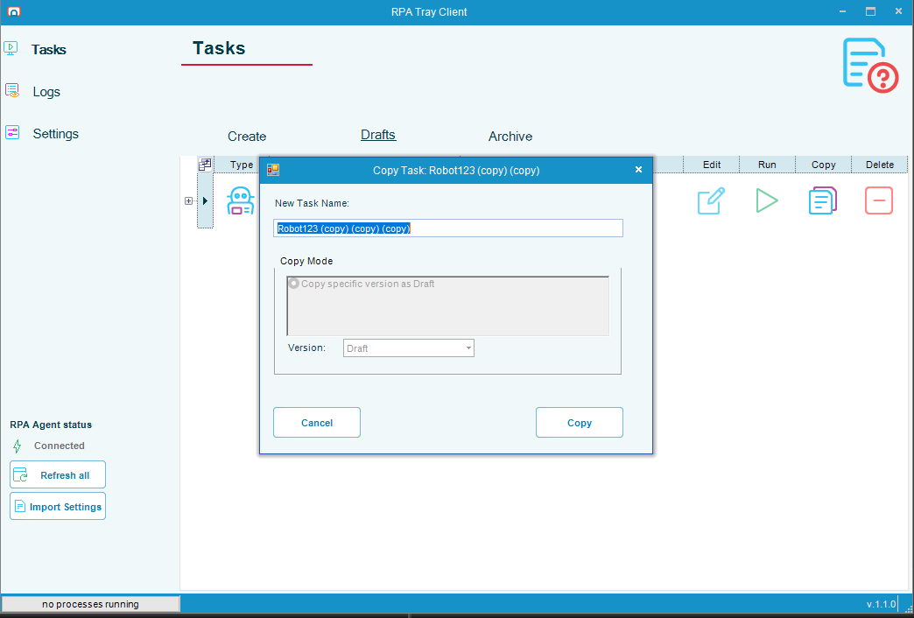
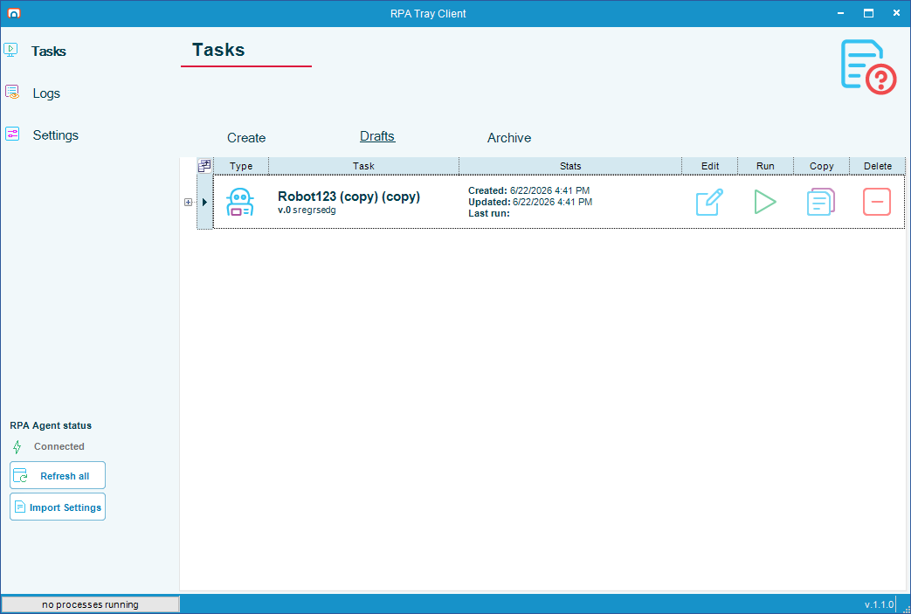

# Copy a Task

## What is it?

Copy duplicates an existing task under a new name without changing the original. You start a copy from the **Copy** button on the **Tasks** page, on either the **Archive** grid or the **Drafts** grid.

How much of the task's history comes along depends on the copy mode you choose.

## Copy modes

The **Copy Task** dialog offers up to three copy modes. The grid you start from determines which modes are available.

| Copy mode | What it does | Where the copy appears |
|-----------|--------------|------------------------|
| **Copy all versions (including draft)** | Copies every published version of the task — and the working draft, if one exists — into the new task. The new task keeps the full version history. | Archive grid |
| **Copy specific version as Version 1** | Copies the version you select and makes it Version 1 of the new task. The new task starts a fresh version history from that version. | Archive grid |
| **Copy specific version as Draft** | Copies the version you select into the new task as a draft (version 0). You can revise the draft before you publish the first version. | Drafts grid |

:::note Copying from the Drafts grid
When you start the copy from the **Drafts** grid, the only available mode is **Copy specific version as Draft**, and the **Version** list is fixed to **Draft**. A draft can only be copied as another draft.
:::

## Copy a task from the Archive grid

To copy a task from the Archive grid, complete the following steps:

1. On the **Tasks** page, select **Archive**.
2. Find the task you want to copy, then select the **Copy** button in its row.

   

3. In the **Copy Task** dialog, enter a name in **New Task Name**, or keep the suggested name.

   

4. Under **Copy Mode**, select the mode you want:
   - **Copy all versions (including draft)**
   - **Copy specific version as Version 1**
   - **Copy specific version as Draft**
5. If you selected a specific-version mode, select the version to copy from the **Version** list.

   

6. Select **Copy**.

The new task appears under the name you entered. When you copy a specific version as Version 1, the copy's history starts at Version 1.

## Copy a version as a draft

Copy a version as a draft when you want to revise it before publishing the first official version of the new task. You can start this from either grid:

- From the **Archive** grid, select **Copy specific version as Draft** in the **Copy Task** dialog.

  

- From the **Drafts** grid, the dialog opens with **Copy specific version as Draft** already selected and the **Version** list set to **Draft**.

  

After you select **Copy**, the new task appears on the **Drafts** grid as a draft (version 0).

## FAQs

**What name does a copy get by default?**
The **New Task Name** field is pre-filled with the original name followed by `(copy)`. You can keep this name or enter your own.

**Does copying change the original task?**
No. The original task and its version history are unchanged. Copy creates a separate task.

**Why can I only copy a draft as another draft?**
A draft has no published versions to copy, so the only option is to copy it into a new draft. Start the copy from the **Archive** grid if you want to copy published versions.

**What is the difference between copying all versions and copying a specific version as Version 1?**
Copying all versions brings the entire version history into the new task. Copying a specific version as Version 1 brings only the version you select and restarts the history at Version 1.

## Related topics

- [Delete a Task](./delete-task-rpa.md)
- [Robot Tasks](./robot-task-rpa.md)
- [OpCon RPA Release Notes](./release-notes.md)

## Glossary

| Term | Definition |
|------|-----------|
| Task | An OpCon RPA unit of automation managed on the **Tasks** page of the RPA Tray Client. |
| Archive grid | The list of published tasks on the **Archive** tab of the **Tasks** page. Each published task can have one or more versions. |
| Drafts grid | The list of unpublished tasks on the **Drafts** tab of the **Tasks** page. A draft is version 0 until it is published. |
| Version | A published revision of a task. Publishing a draft increments the version number. |
| Draft | An unpublished, editable copy of a task, shown as version 0 until it is published. |
