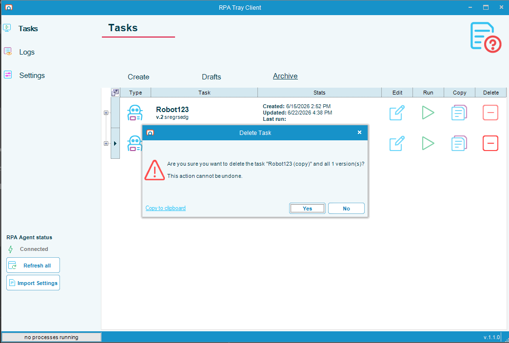
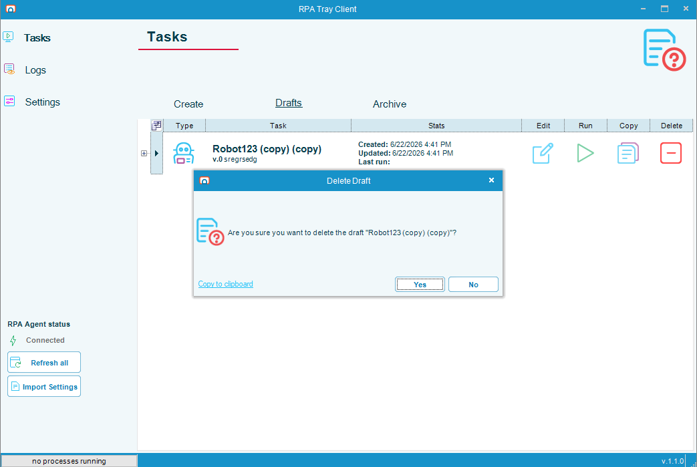

# Delete a Task

## What is it?

Delete removes a task from the **Tasks** page. You start a delete from the **Delete** button on either the **Archive** grid or the **Drafts** grid.

What gets removed — and how strongly the Tray Client warns you — depends on the grid you start from:

| You delete from | What is removed | Confirmation |
|-----------------|-----------------|--------------|
| **Archive** grid | The published task and **all** of its versions | **Delete Task** dialog warns that the action removes every version and cannot be undone |
| **Drafts** grid | The single draft | **Delete Draft** dialog asks you to confirm |

:::caution Deleting a published task cannot be undone
Deleting from the **Archive** grid permanently removes the task and every version it contains. There is no recovery. If you only want to remove unpublished work, delete the draft from the **Drafts** grid instead.
:::

:::note Delete is disabled while a task is running
The per-row **Delete** and **Run** buttons are unavailable while a task is running, to prevent accidental changes to a running task. Wait for the task to finish, then delete it.
:::

## Delete a task from the Archive grid

To delete a published task and all of its versions, complete the following steps:

1. On the **Tasks** page, select **Archive**.
2. Find the task you want to delete, then select the **Delete** button in its row.
3. In the **Delete Task** dialog, confirm the task name and version count, then select **Yes**.

   

The task and all of its versions are removed from the Archive grid. To keep the task, select **No** instead.

## Delete a draft from the Drafts grid

To delete a draft, complete the following steps:

1. On the **Tasks** page, select **Drafts**.
2. Find the draft you want to delete, then select the **Delete** button in its row.
3. In the **Delete Draft** dialog, confirm the draft name, then select **Yes**.

   

The draft is removed from the Drafts grid. To keep the draft, select **No** instead.

## FAQs

**Does deleting a task from the Archive grid remove every version?**
Yes. Deleting from the **Archive** grid removes the task and all of its versions, and the action cannot be undone.

**Can I delete a single version of a published task?**
No. Delete on the **Archive** grid removes the whole task, including every version. There is no option to delete one version.

**Can I recover a task after I delete it?**
No. Deletion is permanent. Before deleting a published task, confirm you no longer need any of its versions.

**Why is the Delete button unavailable for one of my tasks?**
The **Delete** and **Run** buttons are disabled while a task is running. Wait for the task to finish, then delete it.

## Related topics

- [Copy a Task](./copy-task-rpa.md)
- [Robot Tasks](./robot-task-rpa.md)
- [OpCon RPA Release Notes](./release-notes.md)

## Glossary

| Term | Definition |
|------|-----------|
| Task | An OpCon RPA unit of automation managed on the **Tasks** page of the RPA Tray Client. |
| Archive grid | The list of published tasks on the **Archive** tab of the **Tasks** page. Each published task can have one or more versions. |
| Drafts grid | The list of unpublished tasks on the **Drafts** tab of the **Tasks** page. A draft is version 0 until it is published. |
| Version | A published revision of a task. Publishing a draft increments the version number. |
| Draft | An unpublished, editable copy of a task, shown as version 0 until it is published. |
