# Importing and Exporting Tasks

Sometimes you'll want to copy your work from one machine to another — for example, when you set up a new computer, when you move to a replacement machine, or when a coworker needs the same task you've already built. **Export** saves your tasks (and any user variables they need) into a single file. **Import** reads that file on another machine and adds the tasks there.

You'll find the **Export Settings** and **Import Settings** buttons on the main TrayClient dashboard.

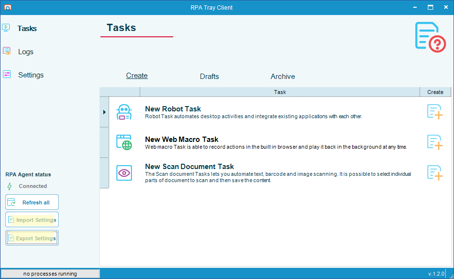

:::tip What you'll need
- Both machines should have the same version of OpCon RPA installed.
- If you password-protect the exported file, you'll need [7-Zip](https://www.7-zip.org/) (a free file utility) to open it outside of RPA. Inside RPA's Import Settings, the password just gets typed in — no extra software needed.
:::

---

## Exporting Tasks

### 1. Open the Export Settings dialog

Click **Export Settings** on the dashboard.

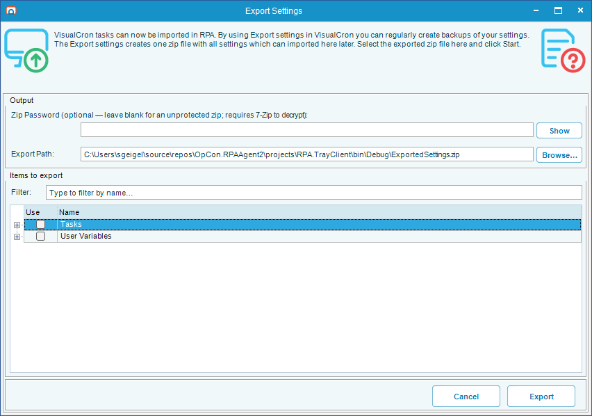

### 2. Pick what you want to export

The dialog has two tables:

- **Tasks** — your recordings, organized by name and version. Each task can have multiple versions, including drafts. A draft is a task you've started building but haven't finalized yet — it's still saved, but it doesn't have to be complete.
- **User Variables** — values you've defined for use inside your tasks (for example, a folder path or a username).

Check the box in the **Use** column next to anything you want to include. Checking a task name will include all its versions; you can also expand a task and pick specific versions.

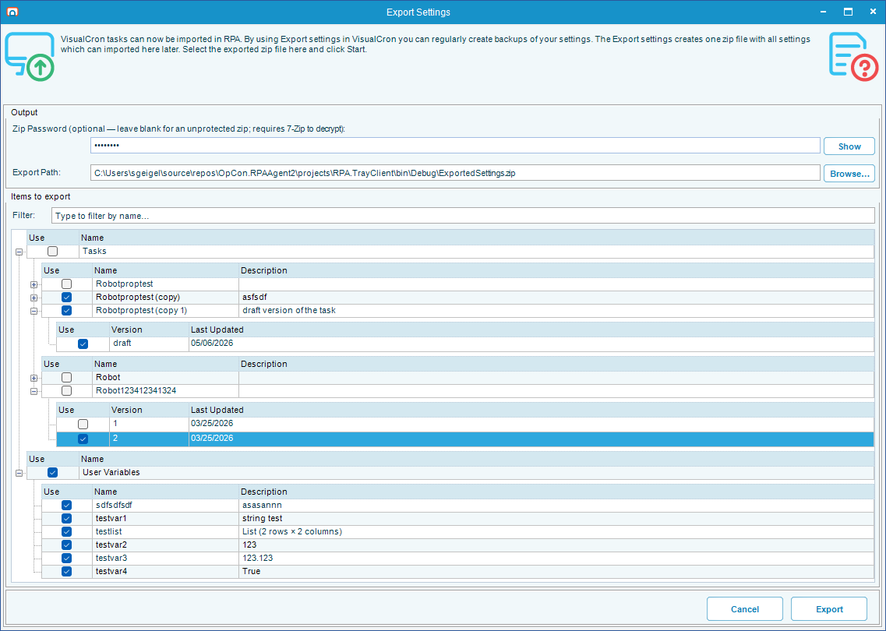

### 3. (Optional) Set a password

If your tasks or variables contain anything sensitive, type a password into the **ZIP Password** field. The password protects the file so it can't be read without it. The password is hidden as you type it.

:::warning Choose passwords carefully
There is no way to recover the password if you forget it. Write it down somewhere safe.
:::

If you leave the password blank, the file will be readable by anyone who has it. If you're exporting user variables that contain anything private, set a password.

### 4. Choose where to save the file

Click **Browse...** and pick a location, or type a path directly. The exported file is always a `.zip` file — RPA will add the `.zip` ending automatically if you forget it.

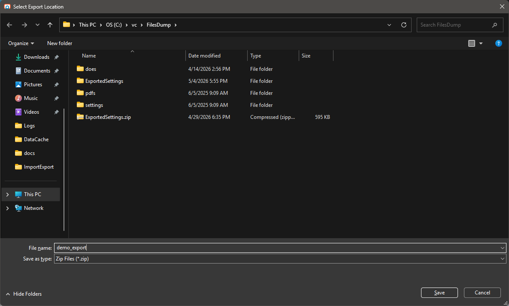

### 5. Click Export

When you're ready, click **Export**. RPA will package everything up. When it's done you'll see a confirmation message.

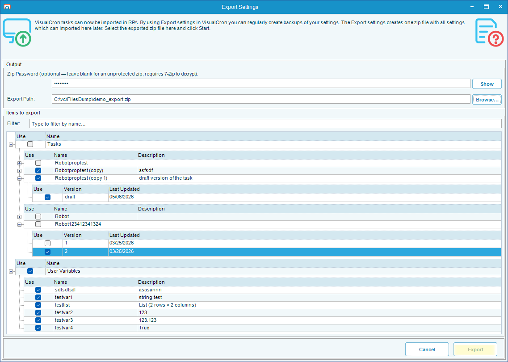

The exported file is now ready to copy to another machine — by email, USB drive, network share, or however you normally move files around.

---

## Importing Tasks

This is the other side of the process: taking an exported file and loading it onto a different machine.

### 1. Open the Import Settings dialog

On the destination machine, click **Import Settings** on the dashboard.

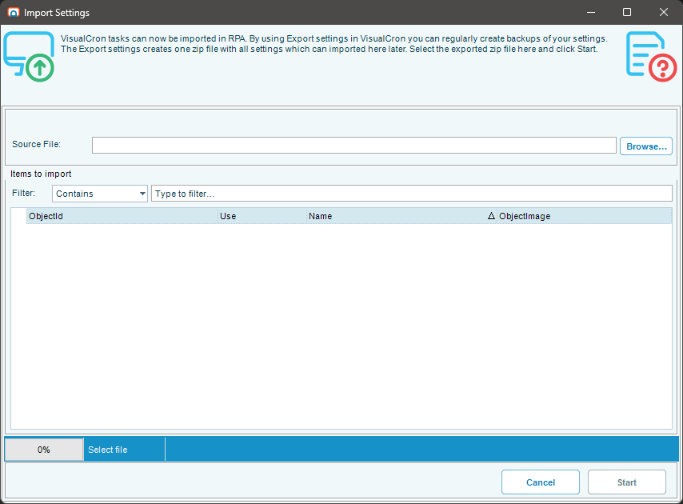

### 2. Pick the file to import

Click **Browse...** and select the `.zip` file you exported earlier.

If the file was password-protected, RPA will ask for the password before showing you the contents.

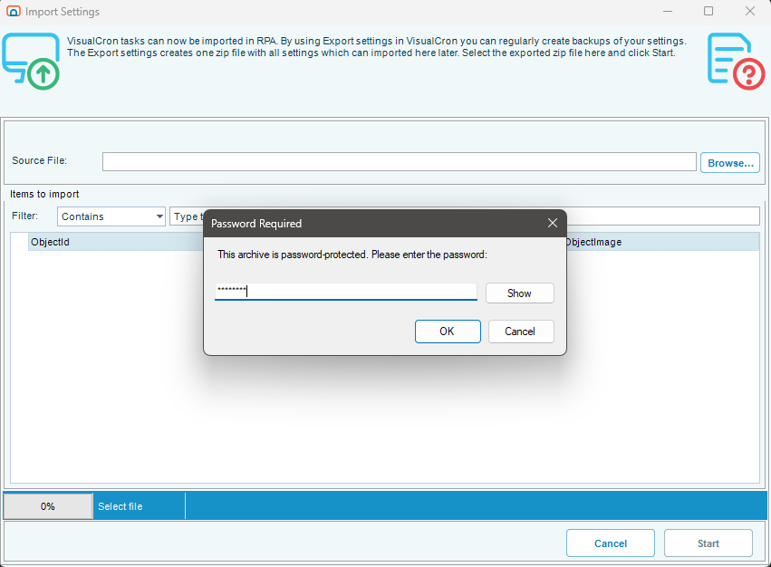

### 3. Choose what you want to import

Just like the Export dialog, the Import dialog shows two tables: tasks and user variables. Check the **Use** boxes next to whatever you want to bring in. You don't have to import everything in the file — you can pick and choose.

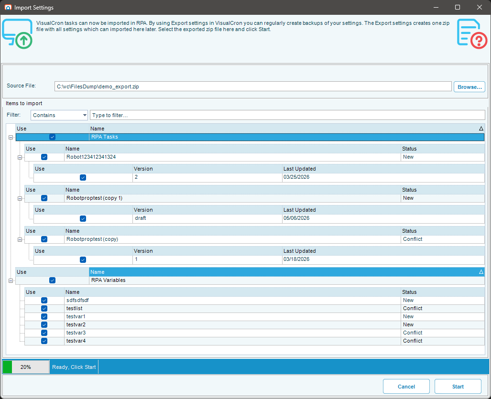

### 4. Click Start

Click **Start** to begin the import.

What happens next depends on what's in the file. Most of the time it just runs straight through and you'll see a confirmation. But if there's something that needs your attention, RPA will ask before continuing. The two main things that can come up are described below.

---

## Handling Conflicts

If a task you're importing already exists on this machine (same name), RPA won't overwrite it without asking. You'll see the **Resolve Import Conflict** dialog for each conflict, with three options:

- **Overwrite the existing item (and all its versions)** — replaces the task on disk along with every version of it. Use this only when you're sure you don't need any of the existing versions.
- **Import under a different name** — keeps the existing task untouched and imports the incoming one under a new name. RPA suggests a default (e.g. `MyTask_imported`) in the **New name** field; edit it to whatever you want.
- **Skip — do not import this item** — leaves the existing task alone and doesn't import the incoming one.

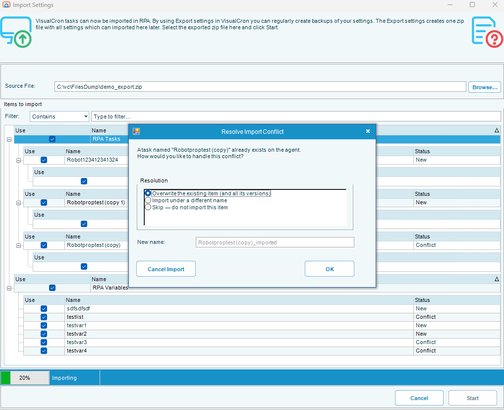

You'll be asked once for each task that conflicts, so you can make different choices for different tasks if you want.

---

## Handling Missing Credentials

A **credential** is a saved username and password that a task uses to log in as a particular Windows user when it runs. Credentials don't get exported with your tasks — that would be a security risk. Instead, the exported file just remembers *which user* the task was set up to run as, and you fill in the password again on the new machine.

When you import a task that runs as a specific user, RPA checks whether that user is already saved on this machine. If not, you'll see this dialog:

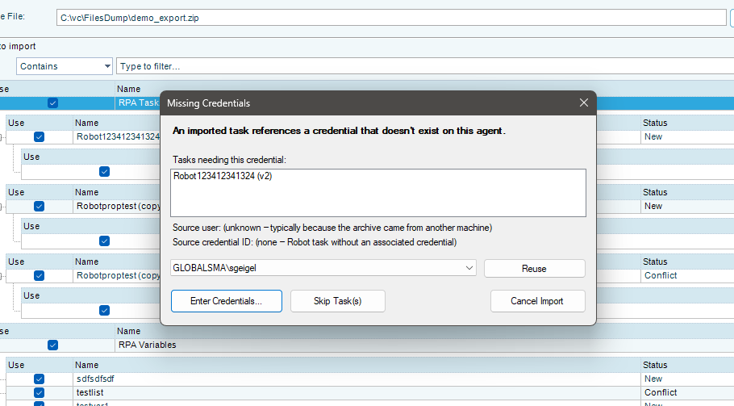

It tells you which task or tasks need the credential, and which user the original machine had set up. You then have four choices:

### Enter Credentials...
Type the password for the user shown. RPA will check the password right then and there to make sure it's correct, then save the credential and use it for the task. If the original username and domain weren't included in the file (which can happen with files from older versions), the dialog will let you fill them in too.

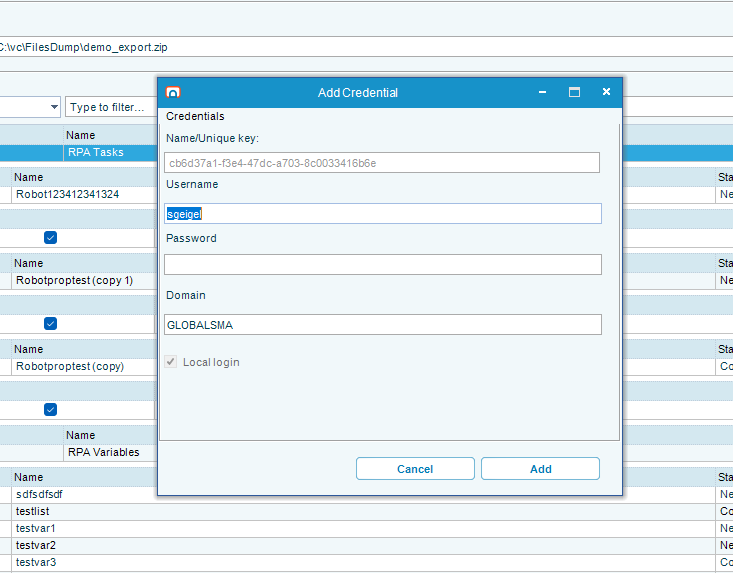

### Reuse
If you've already entered a password for this same user earlier in this import — or if the user already exists on this machine — you can pick them from the dropdown instead of typing the password again. This is the easiest option when you're importing several tasks that all run as the same person.

### Skip Task(s)
Don't import the listed tasks. The rest of your import will continue. You can come back later, log in as the right user, and import again.

### Cancel Import
Stop the entire import. Nothing gets added to this machine.

:::tip Drafts are special
A **draft** is an unfinished task. Drafts don't need a credential to be saved (that's only required when you finalize a task), so RPA won't prompt you for credentials when you import drafts that don't have one set up. You can finish the draft and assign credentials later.
:::

---

## Confirmation

When the import finishes, you'll see a confirmation message and your imported tasks will appear in the dashboard, ready to use.

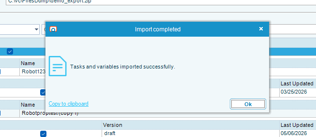

---

## Frequently Asked Questions

**Will my passwords get exported?**
No. Only the username and the user's identifier are recorded in the file. Passwords stay on the original machine and you re-enter them on the new machine when you import. This is by design, for security.

**What if the same user doesn't exist on the new machine?**
You'll see the Missing Credentials dialog (described above) and you can either enter that user's credentials, point it at a different user that does exist on this machine, or skip the task.

**Can I import the same file more than once?**
Yes. If the tasks already exist, you'll be asked what to do for each one (the conflict dialog).

**Why do I need 7-Zip to open the password-protected file outside of RPA?**
The exported file uses a stronger form of password protection than what's built into Windows File Explorer. The free 7-Zip utility understands this format. If you're using the file inside RPA's Import Settings, you don't need 7-Zip — just type the password when asked.

**Can I edit the exported file?**
Don't. The file format is internal to RPA and editing it can break the import. If you need to change something, do it in the original tasks and export again.

**The export went somewhere I didn't expect.**
Make sure you typed a full path (for example `C:\Users\me\Desktop\mytasks.zip`), or click **Browse...** to pick the location visually. If you only typed a folder, RPA will save the file in that folder with a default name.
