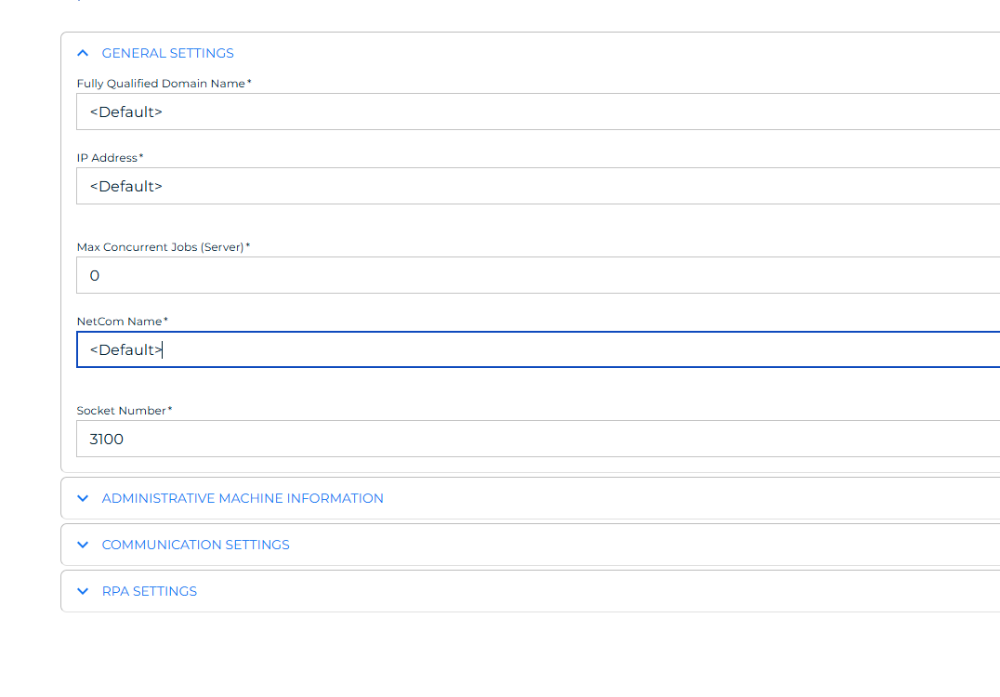
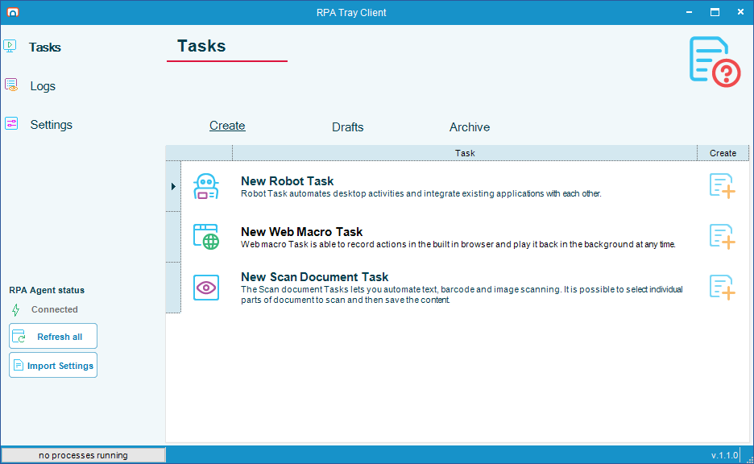
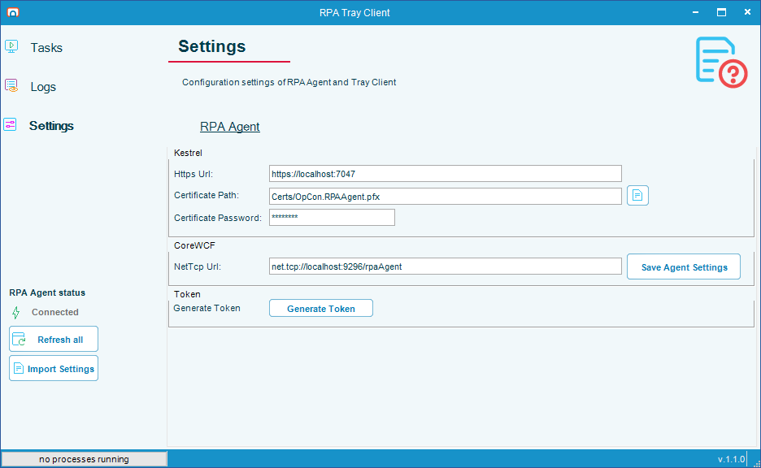
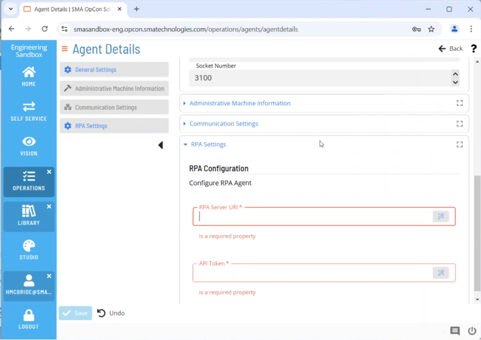
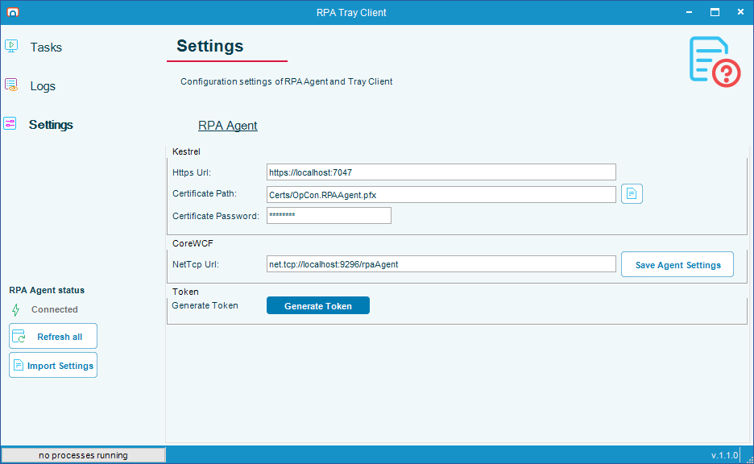
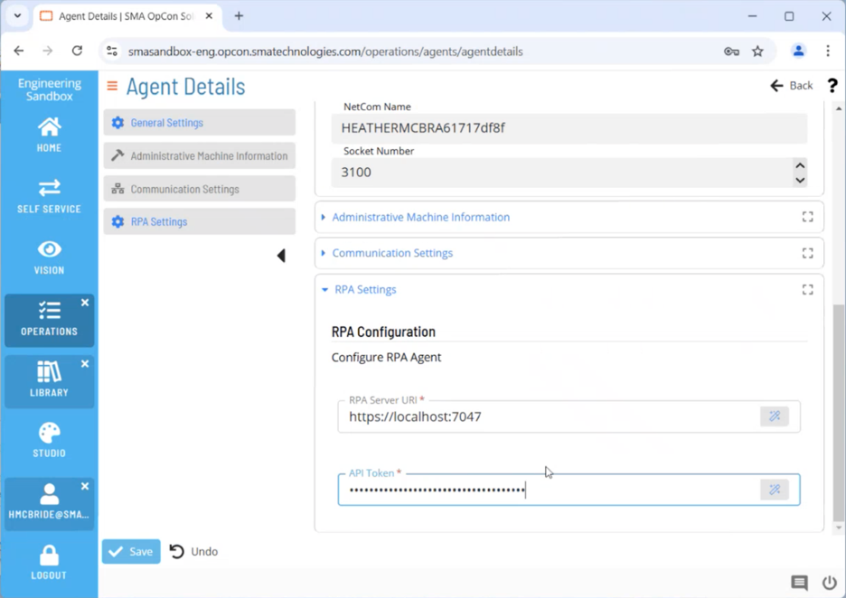

# Installation - OpCon RPA

## What is it?

This page walks you through installing OpCon RPA on a Windows system and connecting it to OpCon. The procedure has five steps:

1. Add an RPA agent in Solution Manager.
2. Install Netcom Relay (cloud installations only).
3. Copy the ACS Plugin DLL into the OpCon plugins directory.
4. Run the RPA Agent installer.
5. Connect the RPA Agent to OpCon.

During the procedure, you will switch between two interfaces:

- The OpCon **Solution Manager** web interface.
- The **RPA Tray Client** that opens after installation on the Windows host.

:::note No OpCon user required
Starting in 1.1.0, OpCon RPA stores tasks locally on the RPA Agent and no longer requires a dedicated OpCon user or an OpCon API connection. You do not need to create an RPA user in Solution Manager.
:::

## Before you begin

Have these three files ready:

| File | Where to get it | What it is for |
|------|-----------------|----------------|
| `SMANetcomRelay.exe` | Provided by your OpCon representative | Cloud installations only — installs Netcom Relay |
| `sma.acs.OpConRPA.dll` | [OpCon Web Installer (OWI)](https://github.com/smatechnologies/opcon-web-installer/releases) — **Integrations** section | The ACS plugin that lets OpCon communicate with the RPA Agent |
| `RPAAgent_x.y.z.msi` | [OpCon Web Installer (OWI)](https://github.com/smatechnologies/opcon-web-installer/releases) — **Agents** section | The RPA Agent installer (`x.y.z` is the version number) |

You also need:

- A Solution Manager user account with privileges to add an RPA agent.
- Local administrator rights on the Windows system where the RPA Agent will run.

:::note On-premises vs. cloud
Netcom Relay is required only when integrating RPA with a cloud instance of OpCon CORE Automate / Solution Manager. On-premises installations skip Step 3.
:::

## Step 1 — Add an RPA agent in Solution Manager

To define the RPA agent that OpCon routes jobs to, complete the following steps:

1. In Solution Manager, go to **Library** > **Agents**.
2. Select **Add** to add a new Agent.
3. Give the agent a name.
4. Select **RPA** from the **Type** list above **General Settings**.
5. When prompted, enter the Netcom Relay name. You must do this before you can open the **RPA Settings** page:
   - **Cloud:** enter the name you used during Relay installation.
   - **On-premises (no Relay):** type `<Default>`.

   

6. Open the **RPA Settings** section at the bottom of the page. Leave this page open — you will return to it in Step 5.

## Step 2 — Install Netcom Relay (cloud only)

If you are installing OpCon RPA for cloud, install Netcom Relay before continuing. For full instructions, see [Netcom Relay setup](https://help.smatechnologies.com/opcon-relay#install).

:::tip
Netcom Relay installation requires local administrator rights. When prompted to allow the app to make changes to your device, select **Yes**.
:::

After Relay is installed, return to this page and continue with Step 3.

## Step 3 — Copy the ACS Plugin DLL

To copy the ACS Plugin DLL into the OpCon plugins directory, complete the following steps:

1. In Windows File Explorer, open the OpCon plugins directory:
   - **On-premises:** `C:\ProgramData\OpConxps\SAM\plugins`
   - **Cloud:** open `C:\ProgramData\OpConxps\` and drill down to the `Plugins` directory.
2. Copy `sma.acs.OpConRPA.dll` into the plugins directory.

## Step 4 — Install the RPA Agent

To install the RPA Agent on the host Windows system, complete the following steps:

1. Double-click `RPAAgent_x.y.z.msi` (the version number may differ).
2. When prompted to allow this app to make changes to your device, select **Yes**.
3. When the installation finishes, the RPA Tray Client opens automatically.

## Step 5 — Connect the RPA Agent to OpCon

In this step, you switch between the RPA Tray Client (on the Windows host) and Solution Manager (in your browser, on the page you left open in Step 1).

### 5a. Copy the RPA HTTPS URI into Solution Manager

1. In the RPA Tray Client, select **Settings** in the left menu.

   

2. On the **RPA Agent** tab, copy the value from the **HTTPS URI** field.

   

3. In Solution Manager, paste the URI into the **RPA Server URI** field of the **RPA Settings** section you opened in Step 1.

   

### 5b. Generate and apply the API token

1. Back in the RPA Tray Client, select **Generate Token**. The token is automatically copied to your clipboard.

   

2. In Solution Manager, paste the token into the **API Token** field.

   

3. Save your Solution Manager changes.

After you save, OpCon can communicate with the RPA Agent. Setup is complete.

## Verify the installation

After the success message:

- Confirm the RPA Tray Client is running in the Windows system tray.
- In Solution Manager, confirm the RPA agent shows as available under **Library** > **Agents**.

## FAQs

**Do I need Netcom Relay if I am not using OpCon Cloud?**
No. Netcom Relay is required only for cloud integrations with OpCon CORE Automate / Solution Manager. On-premises installations skip Step 2.

**Where do I place the ACS Plugin DLL on an on-premises installation?**
For on-premises installations, place `sma.acs.OpConRPA.dll` in `C:\ProgramData\OpConxps\SAM\plugins`.

**Do I need to create an OpCon user for RPA?**
No. Starting in 1.1.0, OpCon RPA stores tasks locally on the RPA Agent and no longer requires an OpCon user or an OpCon API connection.

**What do I enter for the Netcom Relay name on an on-premises installation?**
Type `<Default>`. Solution Manager requires a value before it lets you open the RPA Settings page.

## Glossary

| Term | Definition |
|------|-----------|
| ACS Plugin DLL | The OpCon Application Connection Studio plugin file (`sma.acs.OpConRPA.dll`) used by the OpCon SAM to communicate with the RPA Agent. |
| RPA Agent | The agent that performs robot task automation on a target Windows machine. |
| RPA Tray Client | The local Windows interface that runs alongside the RPA Agent, used to configure the HTTPS URI and API token. |
| Netcom Relay | The OpCon component that routes communication between the OpCon Server and the RPA Agent for cloud installations. |
| OpCon Web Installer (OWI) | A tool that bundles OpCon installer artifacts, including the ACS Plugin DLL and the RPA Agent Installer. |
| Solution Manager | The OpCon web interface used to configure agents and schedules. |
