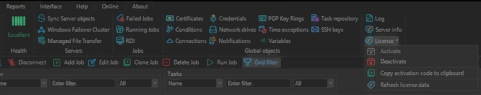

# Install VisualCron for RPA

## What is it?

To use VisualCron for RPA, you install two pieces of VisualCron on the Windows system that runs the RPA workflow, then activate the license:

| Component | Role |
|-----------|------|
| **VisualCron Server** | Windows service that runs jobs and tasks. |
| **VisualCron Client** | User interface that connects to the server to configure and manage jobs. |

The procedure has two steps:

1. Install VisualCron Server and Client by following the **VisualCron vendor documentation**.
2. Return here and **activate the VisualCron license** in the Client.

## Before you begin

You need:

- The Windows system that will host VisualCron for RPA.
- An activation code for VisualCron. A unique license is required for each VisualCron Server installation.
- Local administrator rights on the Windows system.
- Internet access from the Windows system. The activation step contacts the VisualCron website to validate your code.
- A firewall configuration that lets VisualCron reach the Internet.

:::caution One license per server
A unique license is required for each VisualCron Server installation. Multiple clients can connect to one server with one license.
:::

## Step 1 — Install VisualCron Server and Client

Install VisualCron by following the vendor documentation:

- Download VisualCron from the [VisualCron download page](https://www.visualcron.com/download.aspx).
- Follow the [VisualCron installation instructions](https://www.visualcron.com/doc/HTML/download_install_upgrade_and_u.htm).

After the installation finishes, return to this page to activate the license.

## Step 2 — Activate the VisualCron license

To activate VisualCron, complete the following steps:

1. Log in to the VisualCron server you want to activate.
2. Open the activation form:
   - **If you have trial time left:** go to **Client** > **Server** > **License** > **Activate** in the main menu.
   - **If your trial has expired:** the activation form opens automatically when you log in.
3. Enter the activation code in the fields.
4. Select the **Activate** button.

:::caution Online activation
The **Activate** button validates your code by contacting the VisualCron website.

For activation to succeed, the server must be:

- Connected to the Internet.
- Allowed by your firewall to reach the Internet. If your firewall prompts during activation, permit VisualCron to access the Internet.

:::

## Verify the installation

After activation, confirm:

- The VisualCron Server runs as a Windows service in the background. The service status is **Started** when the server computer is started.
- The VisualCron Client can connect to the server.
- The license shows as activated in the Client.

For more on accessing the Client and managing the server after install, see [General Navigation & Management](./navigation-visualcron-rpa.md).

## FAQs

**How many VisualCron licenses do I need?**
One license per VisualCron Server installation. Multiple clients can connect to one server with that single license.

**What if my activation code does not validate?**
Make sure the server has Internet connectivity and that the firewall allows VisualCron to reach the VisualCron website. The **Activate** button must reach the VisualCron site to validate the code.

**My trial has expired and I cannot find the Activate menu — what do I do?**
When the trial has expired, the activation form opens automatically the next time you log in to VisualCron. Log in and enter your activation code there.

**Can I install the VisualCron Client on a separate machine from the Server?**
Yes. The Server and Client can run on the same machine or on different machines. Multiple Clients can connect to a single Server with one license. Refer to the VisualCron vendor documentation for cross-machine installation specifics.

**Where do I get an activation code?**
See [Acquiring a License](./acquiring-a-license-visualcron-rpa.md).

## Glossary

| Term | Definition |
|------|-----------|
| VisualCron Server | The Windows service that runs VisualCron jobs and tasks. |
| VisualCron Client | The user interface that connects to a VisualCron Server to configure and manage jobs. |
| Activation code | The license key entered in the Client to activate VisualCron. Validated by the VisualCron website over the Internet. |
| Trial period | The window during which VisualCron can run without an activated license. After the trial expires, the activation form opens automatically on login. |
