# Mapping OpCon Properties

## What is it?

OpCon RPA tasks can read input values from OpCon and write results back to OpCon by mapping OpCon **Instance Properties** to RPA **OpCon Variables**.

The round trip looks like this:

```
1. OpCon → RPA   Solution Manager supplies the Instance Property when the OpCon job runs.
2. In the task   The task references {OPCON(SCHEDULE|name)} or {OPCON(JOB|name)}.
3. RPA → OpCon   When the task ends, RPA evaluates the Output Expression and
                 writes the result back to the Instance Property — visible in the
                 Daily Schedule and Daily Job screens in Solution Manager.
```

OpCon supports two scopes for an Instance Property:

| Scope | Defined on | Visible to |
|-------|-----------|-----------|
| **Schedule Instance Property** | The schedule | All jobs in the schedule instance |
| **Job Instance Property** | A specific job in the schedule | Only that job instance |

This page walks through the four steps to wire one up: define it in Solution Manager, mirror it in RPA, reference it in the task, and verify the round trip.

## Before you begin

You need:

- An OpCon job (in Solution Manager) that you want to start an RPA task.
- An RPA task that you want to drive with OpCon-supplied values.
- Permission to edit the OpCon job in Solution Manager and the RPA task in the RPA UI.

This procedure works with both single-instance and multi-instance schedule builds. The screenshots use a single-instance build.

## Step 1 — Define the Instance Property in Solution Manager

To define the Instance Property in Solution Manager, complete the following steps:

1. Open the OpCon job in **Master Job Definition**.
2. Add a Schedule Instance Property or a Job Instance Property and give it a name. The name is the key you will use everywhere else.

The screenshots below show a Job Instance Property and a Schedule Instance Property defined on the same master job.

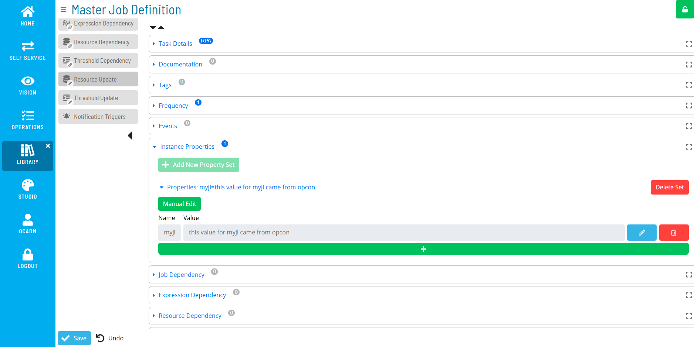

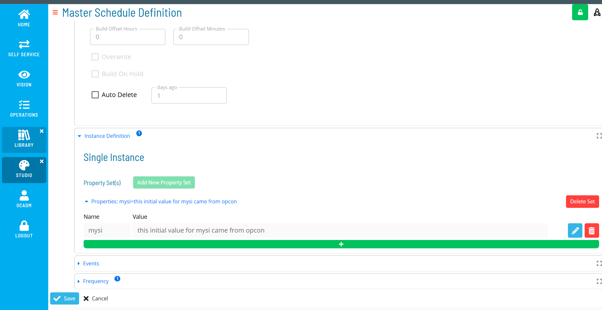

These pictures display values that are used as input values.

:::note Output-only properties
You do not have to define a property in Solution Manager just to receive output from RPA — Output Expressions add the property to the daily schedule or job after the task runs. Defining output-only properties ahead of time can make them easier to manage.
:::

## Step 2 — Mirror the Instance Property in RPA

RPA's Variables screen has a section called **OpCon Variables**, which expands to **Schedule Instance Properties** and **Job Instance Properties**.

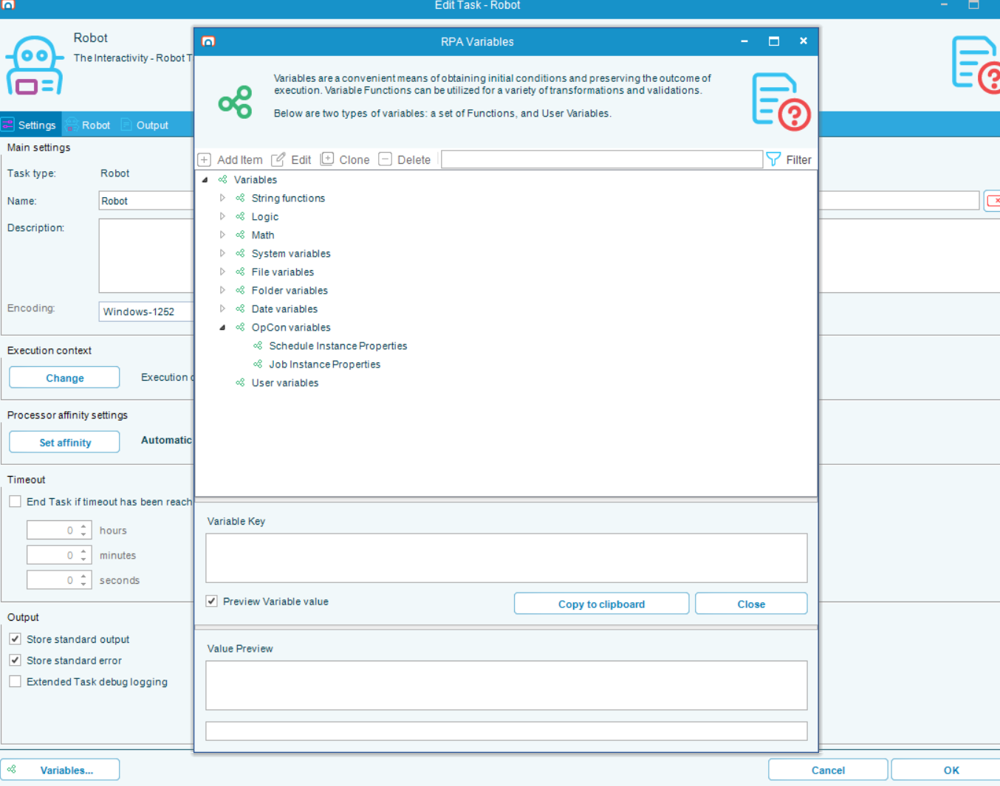

Add a new entry under the matching scope and fill in the edit form. The same form is used for both Schedule and Job Instance Properties.

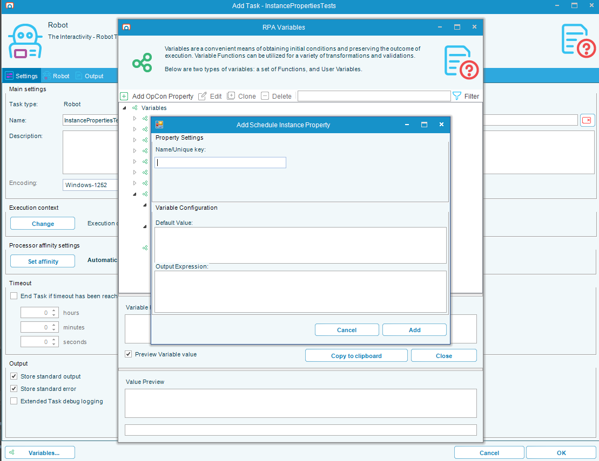

### Fields on the edit form

| Field | What to enter |
|-------|---------------|
| **Name / Unique key** | The exact name from Solution Manager. Must match Step 1 for OpCon to supply the value. The example uses `mysi`. |
| **Default value** | The value RPA uses if OpCon does not supply this property — for example, during a Test Run or a run from the RPA Task Grid. For debugging, enter a known bad value that is easy to spot. |
| **Output Expression** | An RPA expression evaluated after the task runs (whether the task succeeds or fails). Leave blank if you do not want RPA to update OpCon. |

### About the Output Expression

The Output Expression is evaluated as an RPA expression. Anything available on the RPA Variables screen can be used — *User Variables*, *Builtin Functions* (Math, File variables, and so on), and string literals.

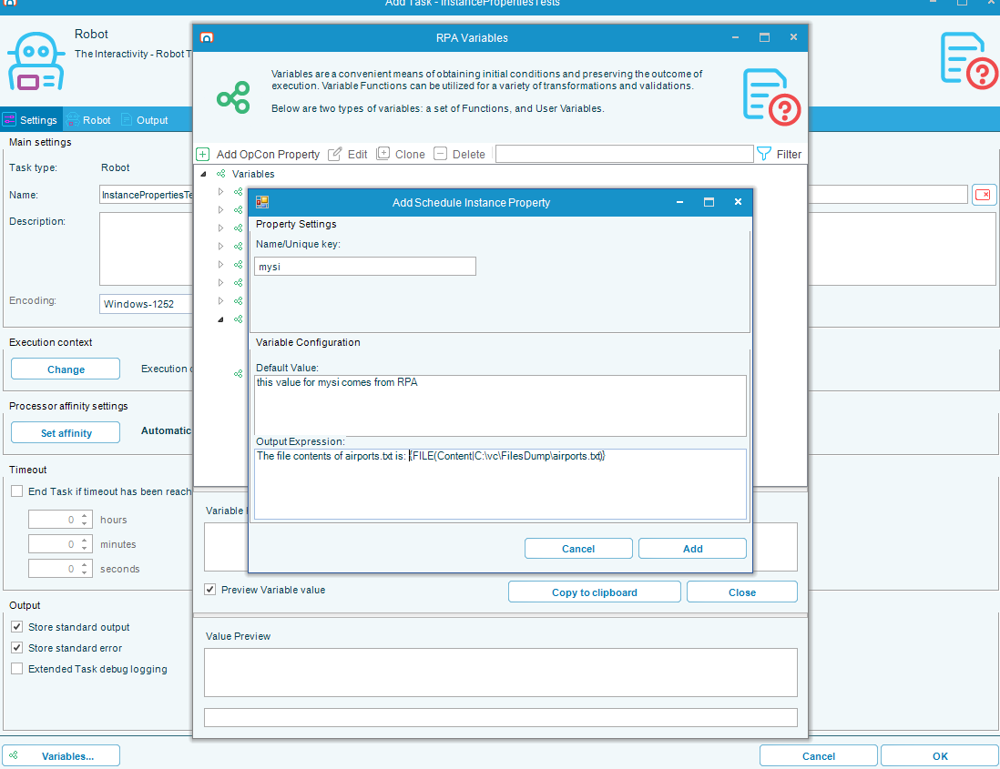

*Example: assigning `mysi` to a string with the contents of `airports.txt` appended.*

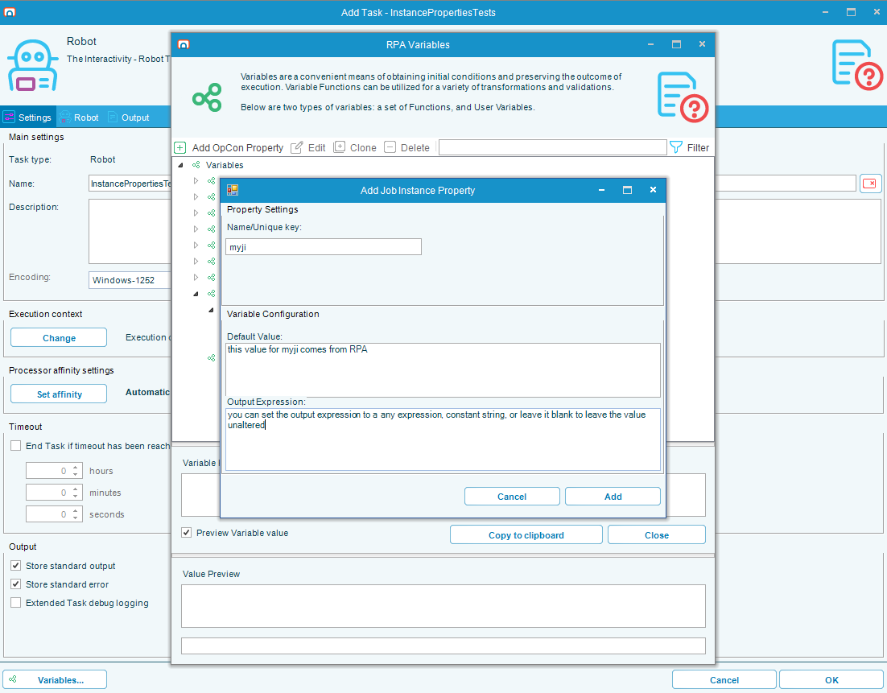

*Example: assigning `myji` to a constant string.*

:::caution The "Set variable" task does not change Instance Properties
The only way to change an Instance Property is through its Output Expression. The **Set variable** task only updates *User Variables*.

To update an Instance Property based on something that happens during the task, copy the value into a *User Variable* during the task, then reference that User Variable in the Output Expression of the Instance Property.
:::

:::tip Test the Output Expression
Use the **Variable Key** and **Variable Preview** fields on the RPA Variables screen to test your output expressions before you run the task end to end.
:::

## Step 3 — Reference the property in a task

To use an Instance Property inside a task step, use the OpCon variable expression syntax:

- `{OPCON(SCHEDULE|myvar)}` — replaced at runtime with the Schedule Instance Property named `myvar`.
- `{OPCON(JOB|myvar)}` — replaced at runtime with the Job Instance Property named `myvar`.

To insert one of these expressions into a task step, complete the following steps:

1. Open the Variables screen of the task.
2. Find the Instance Property you defined in Step 2.
3. Reference it from a step using the OpCon variable expression syntax above.

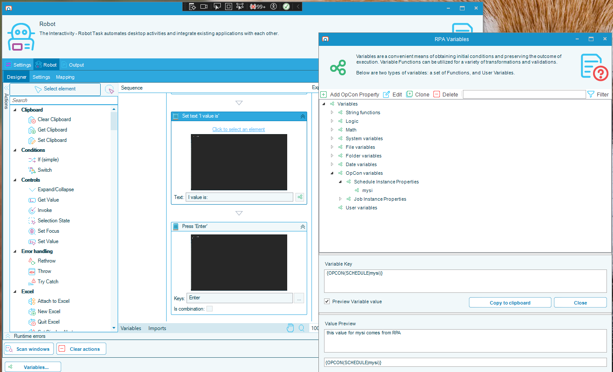

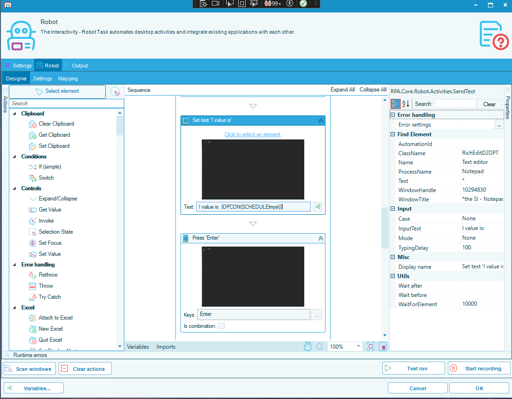

## Step 4 — Verify the round trip

You can run the task two ways: from the RPA Task Grid (uses **Default values** from Step 2) or from Solution Manager (uses **real values** OpCon supplies).

### 4a. Run from the RPA Task Grid (default values)

When you run from the RPA Task Grid or Test Run, RPA does not have OpCon-supplied values, so it uses the **Default value** you set in Step 2. This is the fastest way to confirm the task wires up correctly before involving OpCon.

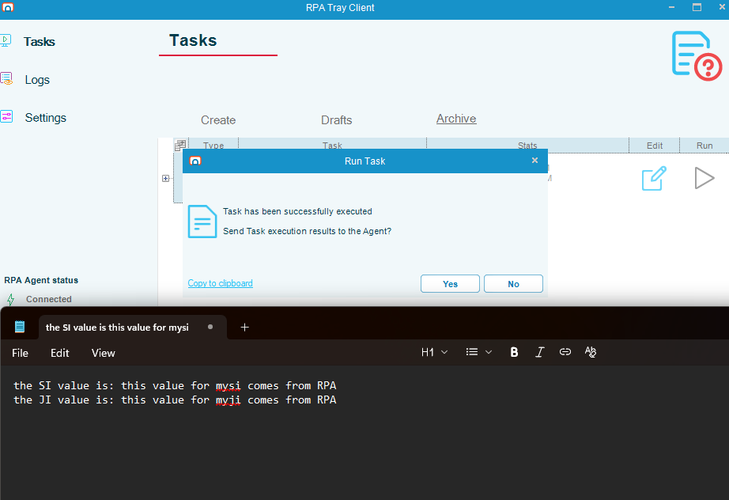

In the screenshot, the sample task has run from the Task Grid. The Robot task has printed the Instance Properties into `notepad.exe`.

### 4b. Run from Solution Manager (real values)

When the task runs from Solution Manager, OpCon supplies the Instance Property values defined on the schedule and job. After the task ends, the Output Expression result appears on the Daily Job and Daily Schedule screens.

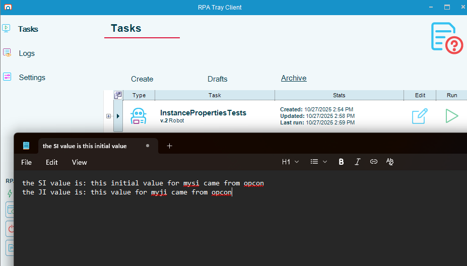

In the screenshot, the sample task has run from Solution Manager. The Robot task has printed the Instance Properties passed into RPA from the test job into `notepad.exe`.

After the Output Expression has been evaluated, the resulting values are visible in Solution Manager:

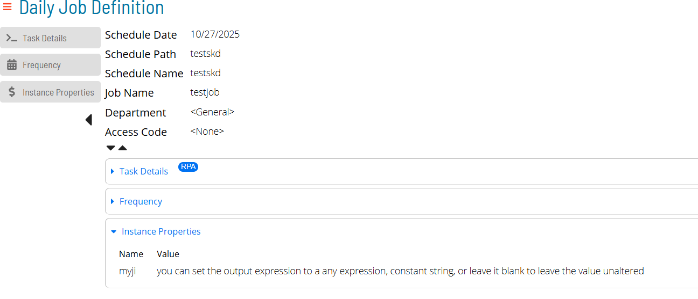

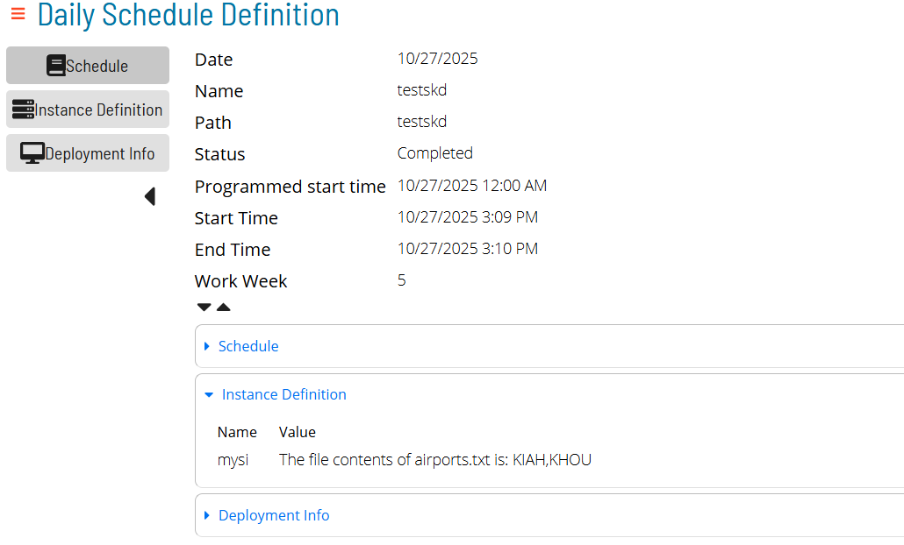

## Reference — variable expression syntax

- `{OPCON(SCHEDULE|name)}` — the Schedule Instance Property `name` for the current schedule instance.
- `{OPCON(JOB|name)}` — the Job Instance Property `name` for the current job instance.

The names inside `{OPCON(...)}` must exactly match the names defined in Solution Manager and mirrored in RPA.

## FAQs

**Can I use multi-instance schedules to pass properties to RPA?**
Yes. Mapping OpCon properties works with both single-instance and multi-instance schedule builds.

**Why is my Output Expression not updating an Instance Property?**
The only way to change an Instance Property is through its Output Expression. The **Set variable** task only updates User Variables. To update an Instance Property based on something that happens during the task, copy the value into a User Variable, then reference that User Variable in the Output Expression of the Instance Property.

**Where does the Default value apply?**
The Default value is used when OpCon does not supply an Instance Property with the matching name, and during Test Runs or runs from the RPA Task Grid.

**Do I have to define an Instance Property in Solution Manager just to receive output from RPA?**
No. Output Expressions add the property to the daily schedule or job after the task runs. Defining output-only properties ahead of time can make them easier to manage but is not required.

**Does the Output Expression run if the task fails?**
Yes. The Output Expression is evaluated whether the task succeeds or fails.

**Can I test the Output Expression before running the task?**
Yes. Use the **Variable Key** and **Variable Preview** fields on the RPA Variables screen to test the expression before running the task end to end.

## Glossary

| Term | Definition |
|------|-----------|
| Schedule Instance Property | A named value scoped to a single OpCon schedule instance, used to pass data into or out of RPA. |
| Job Instance Property | A named value scoped to a single OpCon job instance, used to pass data into or out of RPA. |
| Default value | The value RPA uses for an Instance Property when OpCon does not supply one — for example, during a Test Run or a run from the RPA Task Grid. |
| Output Expression | An RPA expression evaluated after the task runs. The result is written back to the Instance Property and is visible in the Daily Schedule / Daily Job screens in Solution Manager. |
| User Variable | An RPA variable scoped to the current task. Updated by the **Set variable** task. |
| OPCON expression | The variable expression syntax used to reference an Instance Property in a task step: `{OPCON(SCHEDULE\|name)}` or `{OPCON(JOB\|name)}`. |
