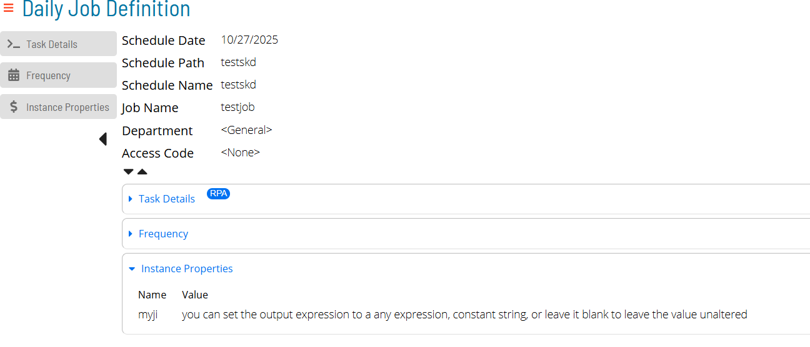

# Mapping OpCon Properties
### Schedule and Job Instance Properties from OpCon
To pass input and output data to RPA, you can use OpCon Instance Properties.
This will work with both single and multi instance schedule builds, but for this example, we'll use single instance.

These pictures display values that are going to be used as input values. While it is not necessary to define an 
output-only instance property, as they will be added to the daily schedule/job after running, it may be easier
to define output-only properties ahead of time
### OpCon Instance Properties in RPA

RPA has added a new section to the variables screen for OpCon Variables. This expands to the 2 options for Schedule and Job Instance Properties.

Both Job and Schedule Instance Properties have this edit form.
#### Name/Unique key
This will be the name of the Schedule or Job Instance Property. Its name will be identical to how it was defined in Solution Manager
so like the previous screenshots, the Name here will be "mysi"
#### Default Value
This value will be selected if OpCon has not supplied an Instance Property with the name. For debugging purposes, it can be
helpful to put a known bad value that is easy to spot. This value will also be used whenever performing a Test Run or running
from the task grid of RPA; making this useful for testing how the task will perform before actually attempting to run the job 
from OpCon.
#### Output Expression
This is what the Job/Schedule Instance Property will be assigned after the task runs; this will occur whether the task succeeds or fails.
**If no output alteration is desired, this field can be left blank**.
RPA will evaluate the text in this field as an Expression; so anything from the RPA Variables screen may be used such as *User Variables* and
*Builtin Functions* (such as Math, File variables, etc).

*This demonstrates assigning mysi to a string with the contents of airports.txt appended*

*This demonstrates assigning myji to a constant string*
### Execution
#### Use in Task Execution
A Job/Schedule Instance Property can be referenced in a variable expression with:
  * `{OPCON(SCHEDULE|myvar)}` -- will be replaced with the contents of the Schedule Instance Property "myvar"
  * `{OPCON(JOB|myvar)}` -- will be replaced with the contents of the Job Instance Property "myvar"

**The only way to change an Instance Property is through *Ouput Expression*s. The "Set variable" task only works for *User Variable*s.
You may however copy Instance Property values into a User Variable and then set the *Output Expression* to the final value of 
the *User Variable* **

#### An Example of running with Default Values

Above is a screenshot where the sample task has ran from the Task Grid. The Robot task has printed the Instance Properties into 
notepad.exe.
#### Running from SM

Above is a screenshot where the sample task has ran from Solution Manager. The Robot task has printed the Instance Properties  
passed into RPA from our test job into notepad.exe.

Now that the Output Expression has been evaluated, we can see them in Solution Manager's Daily Job/Schedule screens.
*Note: you can use the **Variable Key** and **Variable Preview** fields to test your output expressions in RPA's Variable Screen.

