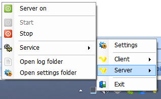
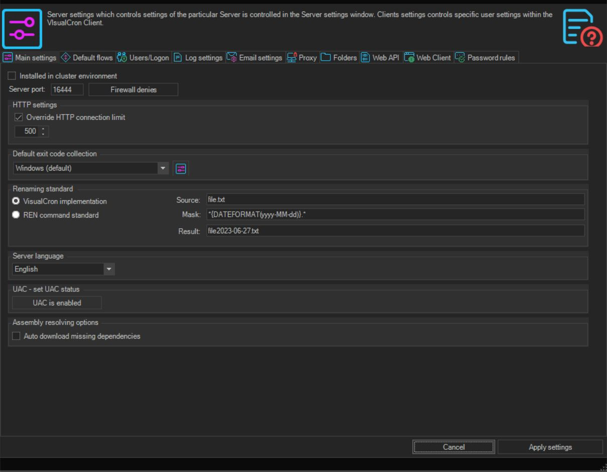
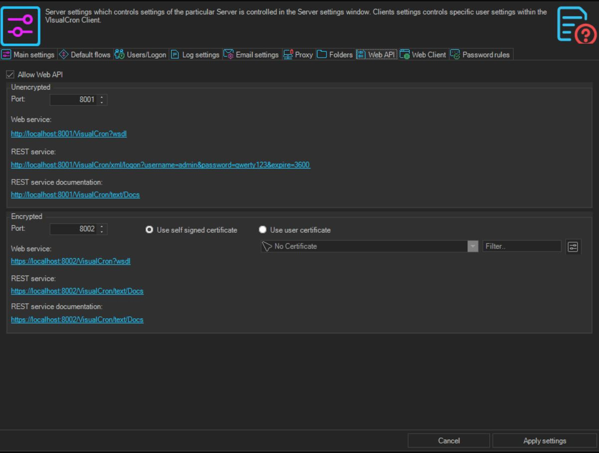
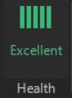

# General Navigation & Management

## What is it?

This page describes how operators and administrators work with a running VisualCron installation:

- How to open the VisualCron Client.
- How VisualCron Server status works (service status vs application On/Off).
- Where to find general server settings, the default port, and the Web REST API toggle.
- Where to find server health.

If you have not installed VisualCron yet, see [Installation - VisualCron Server & Client](./installation-visualcron-rpa.md) first.

## Quick reference

| Task | Where to do it |
|------|----------------|
| Open the VisualCron Client | Desktop shortcut, Start menu, or VisualCron Tray Client |
| Confirm the server service is running | Windows Services — `VisualCron` |
| Turn the server **On** or **Off** at the application level | VisualCron Client — main menu **Server** tab |
| See which server the Client is connected to | Main menu **Server** tab, the Server/Groups/Jobs/Tasks grid, or the status bar |
| Open server settings | VisualCron Client — server settings |
| Turn on the Web REST API | VisualCron Client — server settings, Web API |
| View server historical performance | VisualCron Client — server health indicator |

## Open the VisualCron Client

The VisualCron Client is the main user interface for VisualCron. Use it to configure VisualCron and to manage the Jobs and Tasks that the server runs.

To open the VisualCron Client, use any of the following:

- The Windows desktop shortcut (`VisualCron X`).
- The Start menu: **Programs** > **VisualCron X** > **VisualCron Client**.
- Double-click the **VisualCron Tray Client** in the Windows system tray, or open it.

:::note Client vs Server
- The Client can only connect to the VisualCron Server when the server is running.
- The Server runs as a Windows service. Closing the Client does not affect Jobs and Tasks already running on the Server.
:::

## Server status — service vs. application

VisualCron has two independent statuses you should be aware of:

| Status | What it means | Where to manage it |
|--------|---------------|--------------------|
| **Service status** | Whether the Windows service is running on the host. | Windows Services. The service status is **Started** when the server computer is started. |
| **Application status** *(On / Off)* | Whether the running service is actively looking for Jobs to run. | VisualCron Client — main menu **Server** tab. |

| Application status | Behavior |
|--------------------|----------|
| **On** | The Server looks for Jobs to run on schedule. |
| **Off** | No Jobs run unless a user forces them manually from the Client. |

The Server runs even when no one is logged on to the host computer and even when no Client is connected.

## Server configuration

In the VisualCron Client, the connected server name appears in three places:

- The main menu **Server** *(server-name)* tab.
- The **Username/Server** entry in the Server/Groups/Jobs/Tasks grid.
- The status bar.

:::note Server connections are global
Changing a connection definition affects every command associated with that connection.
:::

### Default port

The default port between the VisualCron Server and the Client is `16444`.

:::caution Remote connections
If you are connecting from outside the network, open port `16444` in your software and/or hardware firewall.
:::

### Turn on the Web REST API

The Web REST API is the HTTP interface VisualCron exposes for programmatic access. Turn it on from the server settings:

Refer to the VisualCron vendor documentation for the full list of Web REST API options and endpoints.

### Server health

:::tip Server Health
Select the health status indicator to view the server's historical performance.
:::

## FAQs

**Does the VisualCron Client need to be running for jobs to run?**
No. The Server runs as a Windows service and runs jobs independently of the Client. The Client is only needed for configuration and management.

**What port does the Client use to reach the Server?**
The default port is `16444`. Open this port in your firewall when connecting remotely.

**My server service is running, but no jobs run on schedule. Why?**
The Server has two statuses. The Windows service may be running while the application status is **Off**. Open the VisualCron Client and confirm the application status is **On** in the main menu **Server** tab.

**What is the difference between the VisualCron Client and the VisualCron Tray Client?**
The VisualCron Client is the full user interface. The VisualCron Tray Client is the system tray entry you double-click to open the full Client.

**Can multiple Clients connect to one Server?**
Yes. Multiple Clients can connect to a single Server. Server connections are global, so any change to a connection definition affects every command using it.

**Where do I view the Server's recent performance?**
Select the server health indicator in the Client.

## Glossary

| Term | Definition |
|------|-----------|
| VisualCron Client | The user interface application used to configure VisualCron and manage Jobs and Tasks. |
| VisualCron Server | The Windows service that runs Jobs and Tasks. |
| VisualCron Tray Client | The system tray entry used to open the VisualCron Client. |
| Service status | Whether the VisualCron Windows service is running on the host. Managed in Windows Services. |
| Application status (On/Off) | Whether the running VisualCron Server is actively looking for Jobs to run. Managed in the VisualCron Client. |
| Web REST API | The HTTP interface that VisualCron exposes for programmatic access. |
| Server health indicator | A control in the VisualCron Client that shows the server's historical performance. |
