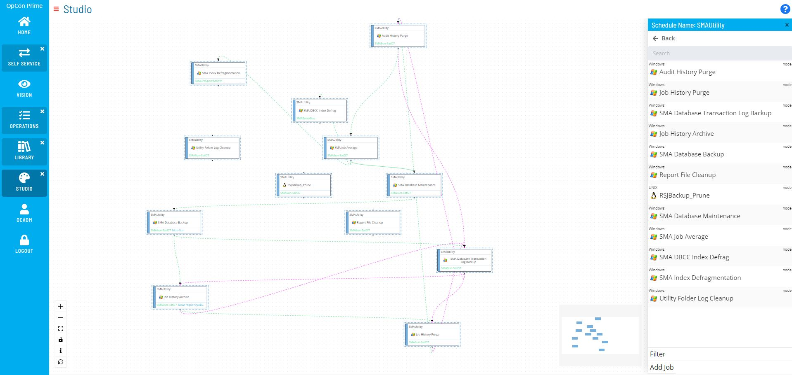
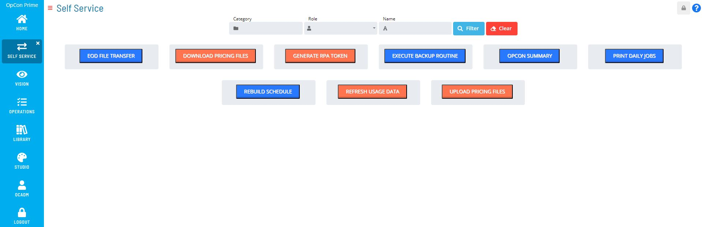
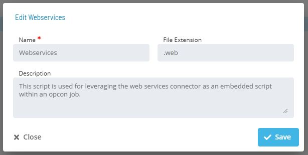
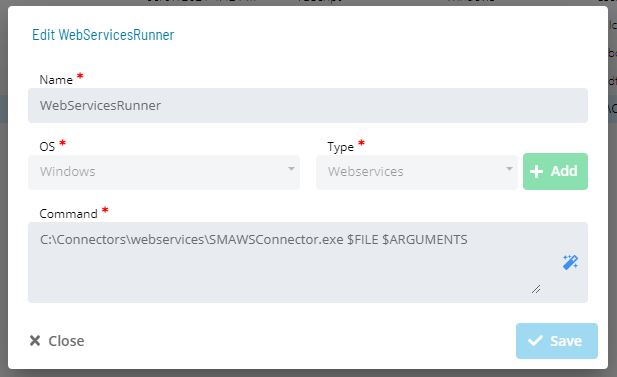
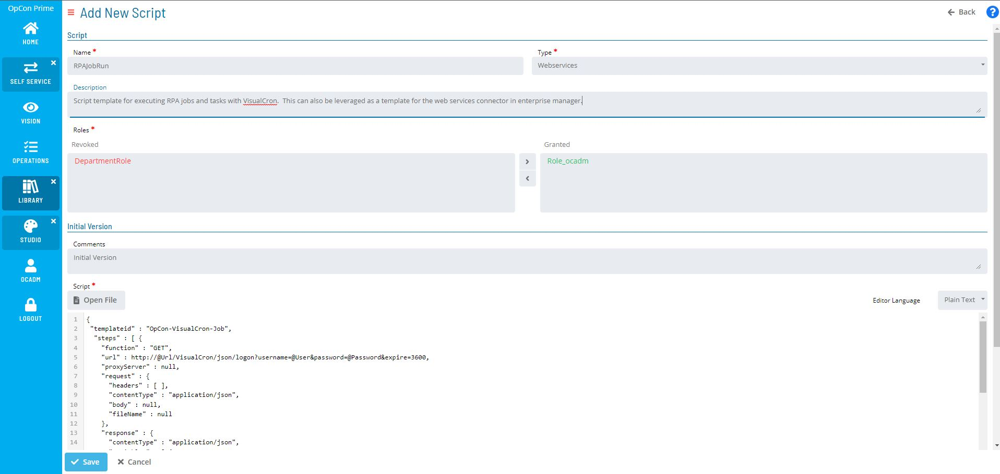
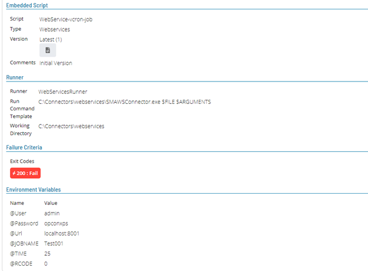

# Orchestration with OpCon

## What is it?

This page describes how to orchestrate VisualCron RPA jobs with OpCon, including how to start RPA jobs by frequency (date and time), by dependency, or on demand from a Self Service button. It also describes how to configure OpCon jobs that initiate the RPA workflow using either the Web Services Connector with a Job Template or the Web Services Connector with Embedded Scripts.

## Managing job execution with OpCon



**Schedule by Frequency *(Time)* or Dependency _(Event)_**

- Orchestrate the RPA workflow with OpCon by expanding schedules to include and start RPA jobs remotely.

- Choose a method for starting the RPA job:
  - Based on calendar and frequency *(date and time)*
  - Completion of a previous job or event in the schedule *(job dependency)*
  - Output of a previous job *(variable trigger)*

:::tip

Supplement daily workflows with RPA jobs to reduce their overall manual burden or to extend the workflow for existing schedules.

:::



**Use Self Service buttons _(On-Demand)_**

RPA jobs can also be initiated on demand by configuring a Self Service button for users. The Self Service button can either start the RPA job directly or indirectly by satisfying a required job dependency.

## OpCon job configuration — create jobs that initiate the RPA workflow

### Option 1 — Enterprise Manager: use the OpCon Web Services Connector with a job template

To create a job that initiates the RPA workflow using the Web Services Connector with a job template, complete the following steps:

1. Install the Web Services Connector ([Download and install with the OpCon Web Installer](https://smatechnologies.hosted-by-files.com/OpConPublicUtilities/OpConWebInstaller.zip)).
2. Create a new schedule or open an existing schedule in workflow designer.
3. Add a new master job:
   1. **Job Type:** *Windows*
   2. **Job Sub-Type:** *Web Services*
4. Import the RPA job template and update the host variable and the job name variable to the name of the RPA job configured in VisualCron.
5. [Copy the OpCon RPA Web Services script from below and save it as a `.web` template](#opcon-rpa-web-services-script). Example: `OpConRPAtemplate.web`.

### Option 2 — Solution Manager: use the Web Services Connector with embedded scripts

To create a job that initiates the RPA workflow using the Web Services Connector with embedded scripts, complete the following steps:

1. In Solution Manager, go to `https://localhost/library/scripts` to create a new script runner and script type.

   :::note New Script Type

   
   `https://localhost/library/scripts/types`
   - **Name:** *Webservices*
   - **File Extension:** *.web*

   :::

   :::note New Script Runner

   
   `https://localhost/library/scripts/runners`
   - **Name:** *WebServicesRunner*
   - **OS:** *Windows*
   - **Script Type:** *Webservices*
   - **Command Template Parameters:** `C:\[Path to Webservices Connector]\SMAWSConnector.exe $FILE $ARGUMENTS`

   :::

   

2. Modify and upload the script to the OpCon script repository at `https://localhost/library/scripts`.
   - The script is parameterized for user codes, password, URL, job name, and variables, with the arguments set as variables.
3. In Solution Manager, go to `https://localhost/studio` to create a new schedule or open an existing schedule in Studio.
4. Add a new Windows master job with the job action **Embedded Script**, assign the script runner and embedded script to the master job, and set the values for the environment variables.

   

---

## OpCon RPA Web Services script

:::note OpCon RPA Web Services Script Overview

*This example script performs 4 functions and can be used as a template for setting up RPA with OpCon:*

1. Retrieve an authentication token and update the associated variable for subsequent steps.
2. Retrieve the id of the job (required to start the task).
3. Start the task by passing variable values.
4. Monitor the task to completion.

:::

```json
{
 "templateid" : "OpCon-VisualCron-Job",
  "steps" : [ {
    "function" : "GET",
    "url" : http://@Url/VisualCron/json/logon?username=@User&password=@Password&expire=3600,
    "proxyServer" : null,
    "request" : {
      "headers" : [ ],
      "contentType" : "application/json",
      "body" : null,
      "fileName" : null
    },
    "response" : {
      "contentType" : "application/json",
      "variables" : [ {
        "name" : "@Token",
        "value" : "$.Token"
      } ],
      "ignoreResult" : false,
      "stepCompletionCode" : 200,
      "responseDataCheck" : null,
      "fileName" : null
    }
  }, {
    "function" : "GET",
    "url" : http://@Url/VisualCron/json/Job/GetByName?token=@Token&name=@JOBNAME,
    "proxyServer" : null,
    "request" : {
      "headers" : [ ],
      "contentType" : "application/json",
      "body" : null,
      "fileName" : null
    },
    "response" : {
      "contentType" : "application/json",
      "variables" : [ {
        "name" : "@Jobid",
        "value" : "$.Id"
      } ],
      "ignoreResult" : false,
      "stepCompletionCode" : 200,
      "responseDataCheck" : null,
      "fileName" : null
    }
  }, {
    "function" : "GET",
    "url" : http://@Url/VisualCron/json/Job/Run?token=@Token&id=@Jobid&variables=Test001Time=@TIME|Test001RCode=@RCODE,
    "proxyServer" : null,
    "request" : {
      "headers" : [ ],
      "contentType" : "application/json",
      "body" : null,
      "fileName" : null
    },
    "response" : {
      "contentType" : "application/json",
      "variables" : [ ],
      "ignoreResult" : false,
      "stepCompletionCode" : 200,
      "responseDataCheck" : null,
      "fileName" : null
    }
  }, {
    "function" : "GET",
    "url" : http://@Url/VisualCron/json/Job/Get?token=@Token&id=@Jobid,
    "proxyServer" : null,
    "request" : {
      "headers" : [ ],
      "contentType" : "application/json",
      "body" : null,
      "fileName" : null
    },
    "response" : {
      "contentType" : "application/json",
      "variables" : [ ],
      "ignoreResult" : false,
      "stepCompletionCode" : 200,
      "responseDataCheck" : {
        "goodFin" : "Success",
        "badFin" : "Failed",
        "attributeToCheck" : "$.Tasks.[0].Stats.Result",
        "poll" : true,
        "pollDelay" : 3,
        "pollInterval" : 2,
        "pollMaxTime" : null
      },
      "fileName" : null
    }
  } ],
  "variables" : [],
  "environmentVariables" : [ ],
  "properties" : [ ]
}
```

## FAQs

**Which trigger types can start an RPA job from OpCon?**
RPA jobs can be started by frequency (date and time), by job dependency, by variable trigger, or on demand from a Self Service button.

**Do I need Enterprise Manager or Solution Manager for VisualCron RPA orchestration?**
Either tool can be used. Enterprise Manager uses the Web Services Connector with a job template; Solution Manager uses the Web Services Connector with Embedded Scripts.

**What does the example Web Services script do?**
The script retrieves an authentication token, looks up the job ID, starts the task with variable values, and polls until the task completes.
