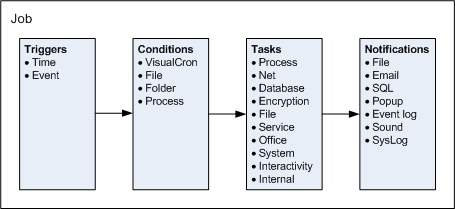

# Configuration Overview

## What is it?

This page introduces the VisualCron objects you work with when planning an RPA workflow and shows how each maps to its OpCon equivalent. Read this page before building your first VisualCron RPA workflow, or any time you need to relate a VisualCron concept to an OpCon concept.

## How VisualCron objects work together

VisualCron uses six core object types to define automation. They run in a fixed order:

```
Trigger ──▶ Condition ──▶ Job ──▶ Task ──▶ Notification
```

| # | Object | What happens |
|---|--------|--------------|
| 1 | **Trigger** | A time- or event-based trigger fires a Job to run. |
| 2 | **Condition** | A check that is evaluated before a Job or a Task starts. |
| 3 | **Job** | A grouping that contains one or more Tasks. |
| 4 | **Task** | A specific process to run. A Job can contain multiple Tasks of different types. |
| 5 | **Notification** | One or more notifications can fire when the Job or its Tasks complete. |

Two additional object types support authentication and connectivity:

| Object | Purpose |
|--------|---------|
| **Credential** | A stored set of authentication details used by Jobs and Tasks. |
| **Connection** | A reusable connection definition VisualCron uses to reach an external system. |



## Mapping VisualCron objects to OpCon

If you already use OpCon, the table below shows the closest OpCon equivalent for each VisualCron object.

| VisualCron object | OpCon equivalent | What they have in common |
|-------------------|------------------|--------------------------|
| **Job** | Schedule | Both group and run one or more units of work. |
| **Task** | Job | Both represent a specific process to run. |
| **Trigger** | Event or Cloud Trigger | Both fire work to start, by time or by event. |
| **Condition** | Dependency | Both gate a unit of work on a check. |
| **Credential** | System / Batch Users | Both store authentication details for running work. |
| **Connection** | Agent Users | Both define service-specific user credentials for reaching external systems. |

:::note Naming difference
The most common point of confusion is **Job vs Task**. In VisualCron, a *Job* is the grouping (what OpCon calls a *Schedule*) and a *Task* is the unit of work (what OpCon calls a *Job*). Keep this in mind when reading VisualCron documentation alongside OpCon documentation.
:::

## Where to go next

- To install VisualCron, see [Installation - VisualCron Server & Client](./installation-visualcron-rpa.md).
- To open the Client and manage the server, see [General Navigation & Management](./navigation-visualcron-rpa.md).
- To build VisualCron RPA jobs end to end, see [RPA Job Configuration with VisualCron](./rpa-job-config-with-visualcron.md).
- To start VisualCron RPA jobs from OpCon, see [Orchestration with OpCon](./orchestration-with-opcon-visualcron-rpa.md).

## FAQs

**What order do VisualCron objects run in?**
The flow is Trigger > Condition > Job > Task > Notification. A trigger fires a Job, conditions are evaluated before a Job or Task runs, the Job runs one or more Tasks, and notifications run after the Job or Tasks complete.

**How do VisualCron Jobs and Tasks compare to OpCon Schedules and Jobs?**
A VisualCron *Job* groups one or more *Tasks*, similar to how an OpCon *Schedule* groups *Jobs*. A VisualCron *Task* represents a specific process to run, similar to an OpCon *Job*. The names are inverted between the two products, so be careful when reading documentation that uses both.

**Can a single Job contain multiple Tasks of different types?**
Yes. A Job can include one or more Tasks of different types.

**Are Credentials and Connections reusable across Jobs?**
Yes. Both Credentials and Connections are reusable definitions you can attach to multiple Jobs and Tasks.

## Glossary

| Term | Definition |
|------|-----------|
| Job (VisualCron) | A grouping of one or more Tasks in VisualCron. Equivalent to an OpCon Schedule. |
| Task (VisualCron) | A specific process to run in VisualCron. Equivalent to an OpCon Job. |
| Trigger | A time- or event-based condition that fires a VisualCron Job to run. |
| Condition | A check evaluated before a VisualCron Job or Task runs. |
| Notification | An action fired after a Job or Task completes — for example, an email or alert. |
| Credential | A stored set of authentication details used by VisualCron. |
| Connection | A reusable connection definition that VisualCron uses to reach an external system. |
