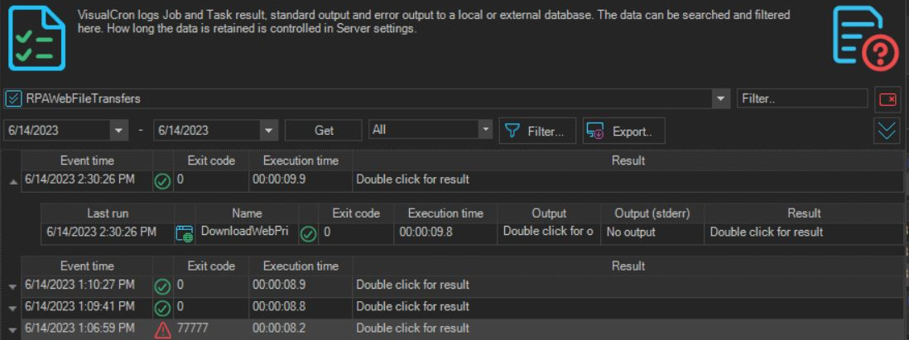
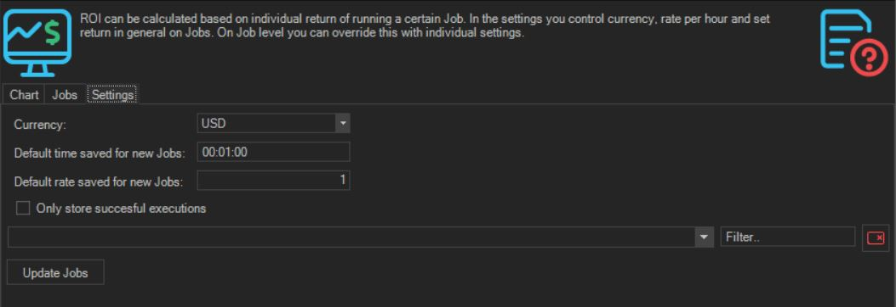
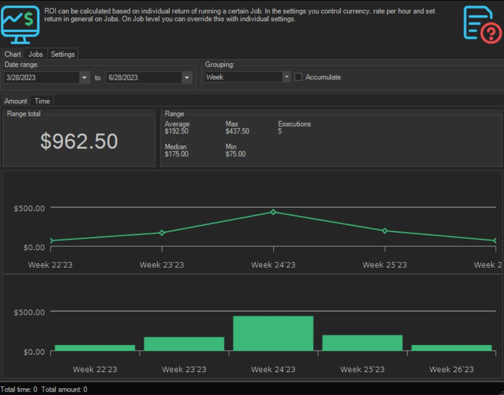
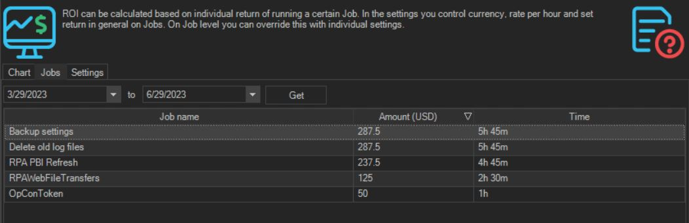

# Reporting & Metrics

## What is it?

This page describes where to find VisualCron RPA reporting and metrics, including job and task log history and ROI tracking.

## RPA job history

:::tip

To access job or task log history, right-click the job or task and select **log history** from the menu.

:::

## Measure and track ROI for RPA tasks

### ROI performance

#### Review ROI savings by time or cost

#### Review ROI savings by job

## FAQs

**Where do I view a job or task's log history?**
Right-click the job or task and select **log history** from the menu.

**Where is ROI tracked?**
ROI values are captured at the job level. ROI Performance reports show savings by time or cost, and by job.
