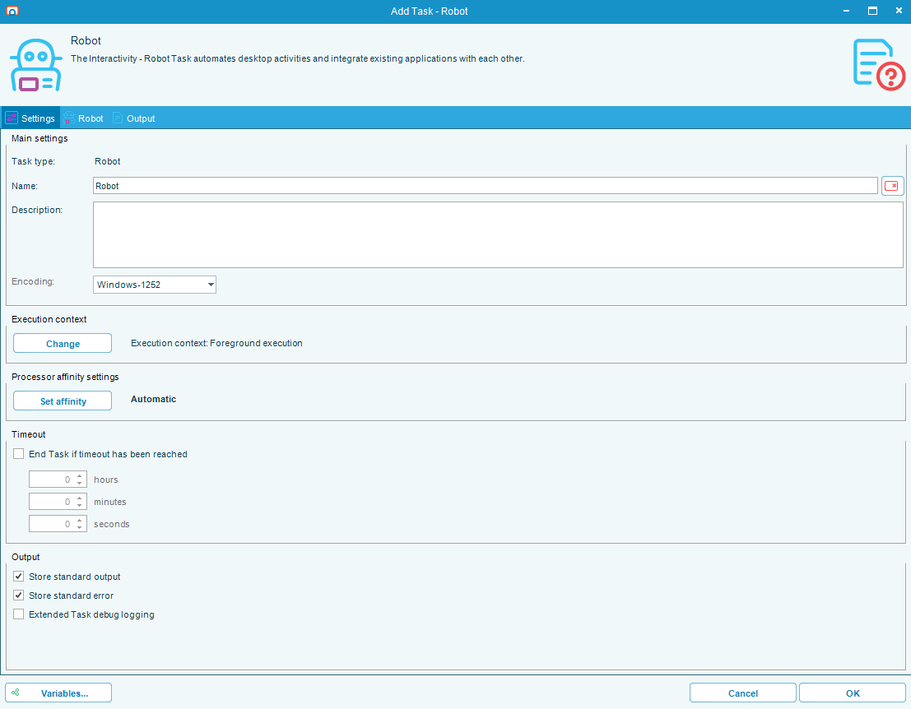
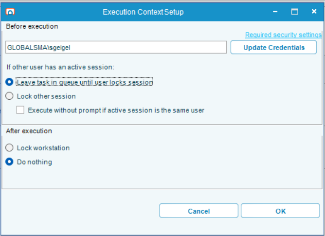
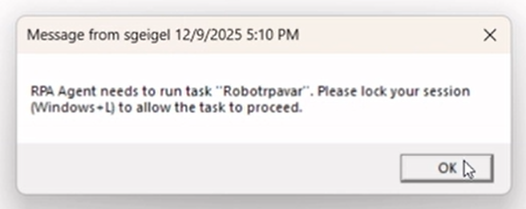
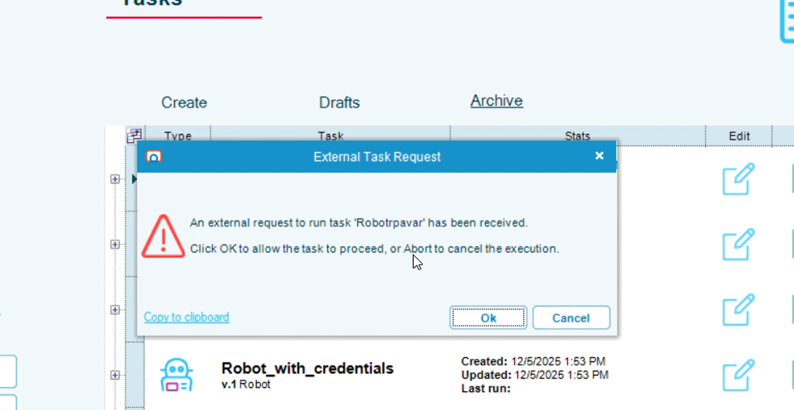
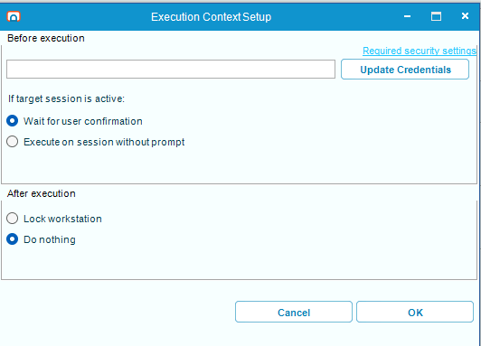
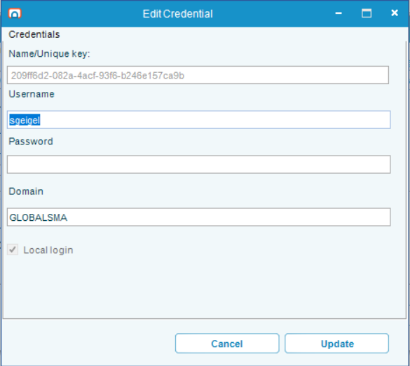

# Robot Tasks

## What is it?

A Robot Task interacts with Microsoft Windows on behalf of a user. Robot Tasks can be created by:

- Recording actions a user performs on the desktop, or
- Dragging and dropping individual activities into the workflow, or
- Combining both.

Three concepts work together to make a Robot Task run safely and predictably:

| Concept | What it controls |
|---------|------------------|
| **Robot Task** | What the task does — the recorded or dragged activities. |
| **Execution Context** | When and how the task interacts with the machine — the user identity, what happens before the task runs, and what happens after. |
| **Credentials** | The encrypted Windows credentials RPA uses to switch into the correct user session at runtime. |

This page explains all three.

## Quick reference — pick a behavior

| What you want | On a single user machine | On a multi-user machine |
|---------------|--------------------------|-------------------------|
| Run automatically with no popups | Select **Lock other session** | Select **Execute on session without prompt** |
| Approve each task before it runs | Select **Leave task in queue until user locks session** | Select **Wait for user confirmation** |
| Leave the session unlocked after the task | Select **Do nothing** under After Execution Behaviors | Select **Do nothing** under After Execution Behaviors |

### Machine type quick check

| Machine type | Examples | Key difference |
|--------------|----------|----------------|
| **Single user** | Windows 10, Windows 11 | Only one user can control the desktop at a time. |
| **Multi-user** | Windows Server 2016 / 2019 / 2022 | Multiple users can have active desktop sessions simultaneously. |

## Execution Context

The Execution Context is set on the main form using the button named **Execution Context**. It controls how the task interacts with the machine before and after the task runs. By default, the Execution Context is set to the user that is currently logged in and editing the task.

:::tip Required at Publish, optional for Drafts
An Execution Context is required to **Publish** a Robot Task. **Drafts** can be saved without one. When another user edits this task, your Execution Context settings remain unchanged unless that user opens the Execution Context menu.
:::

:::warning RPA cannot log you in after a reboot
RPA can unlock locked sessions, but it **cannot log in for you**. After a machine reboot, manually log in as each user, then lock each session before RPA can run tasks for those users.

**Example:** if you have tasks running as `UserA` and `UserB`:

1. After reboot, log in as `UserA`.
2. Press Win+L to lock the session.
3. Log in as `UserB`.
4. Press Win+L to lock the session.
5. RPA can now run tasks for both users.

:::

## Before Execution Behaviors

The Before Execution Behavior controls what happens **between** the moment RPA receives a command to run the task and the moment the task starts.

The available options depend on the machine type.

### Single user machines

For single user machines (Windows Desktop editions), only one user can control the machine at a time, so RPA may need to switch sessions before running.

To assign your user to the task, select either the **Update Credentials** or **Add Credentials** button.

| Option | What RPA does | Use when |
|--------|---------------|----------|
| **Leave task in queue until user locks session** | Shows a warning dialog to the currently logged-in user. The task waits until the user locks the session (selects **OK** on the dialog or presses Win+L). | Testing, or when combined with **Execute without prompt if active session is same user**. |
| **Execute without prompt if active session is same user** *(modifier — only available with the option above)* | Skips the warning dialog when the Execution Context user matches the currently logged-in user, and runs the task immediately. | Same-user automation that should not interrupt the user. |
| **Lock other session** | Locks the active session if it belongs to a different user than the Execution Context user, then runs the task. If the active session already belongs to the Execution Context user, runs the task directly. | Hands-off, scheduled automation. |

The warning dialogs look like this:

*Different user logged in: the user can dismiss the message, but the task waits until the session is locked.*

*Same user logged in: the user can abort, or select **OK** to start the task.*

### Multi-user machines

For multi-user machines (Windows Server editions), multiple users can have active desktop sessions at the same time. Session switching is not needed, but locking sessions is still important for security.

To assign your user to the task, select either the **Update Credentials** or **Add Credentials** button.

Before the task runs, the session is unlocked (if it was locked).

| Option | What RPA does | Use when |
|--------|---------------|----------|
| **Wait for user confirmation** | Shows a warning dialog. The task waits until the user selects **OK**. | Testing, or when a human gate is required. |
| **Execute on session without prompt** | Runs the task on the user's session immediately, with no warnings or dialogs. | Hands-off, scheduled automation. |

The Wait for user confirmation dialog looks like this:

:::note RDP sessions
When RPA locks a session, it does not end RDP connections. If the user was logged in through RDP, the connection remains active, but the session shows a lock screen.
:::

## After Execution Behaviors

After Execution Behaviors apply to both single user and multi-user machines.

| Option | What RPA does | Use when |
|--------|---------------|----------|
| **Lock Workstation** | Locks the current user (equivalent of Win+L) after the task completes. | Default, more secure choice. |
| **Do nothing** | Leaves the running user's session unlocked. | Chaining multiple RPA tasks under the same user, to avoid delays from repeated lock/unlock cycles. |

## Credentials

The edit credentials screen shows information from your current Windows session. All fields are read-only and automatically filled from your session.

### How your credentials are protected

Your credentials are secured through several layers:

1. **Secure transmission:** Credentials are sent over HTTPS to the RPAAgent service on localhost. The connection also uses your Windows session for authentication.
2. **Encryption:** Your username and password are encrypted with a randomly generated key created the first time you started RPA.
3. **GUID reference:** Internally, RPA references you only by a GUID (unique identifier). Your encrypted credentials are never decrypted and sent back to you, and cannot be read by the Tray Client.
4. **One-time entry:** After initial setup, you do not need to enter your password again when creating additional Execution Contexts.

### First-time setup

If this is the first time setting up your user for RPA, complete the following steps:

1. Enter your Windows password.
2. Confirm the dialog.
3. RPA verifies the password is correct for this user account.

### How credentials are used during execution

When the Agent service receives a command to run a task:

1. It looks up the GUID for the task.
2. It decrypts the stored credentials.
3. It switches to the appropriate user session.
4. It promptly discards the decrypted credentials from memory.

Credentials are never stored in plain text and are never persisted in decrypted form.

## FAQs

**Why does my task wait when I select "Leave task in queue until user locks session"?**
RPA intentionally waits until the user locks the session (by selecting **OK** on the warning dialog or pressing Win+L) before running the task. This lets the user approve or abort the task.

**Why can't RPA run my task after a server reboot?**
RPA can unlock a locked session, but it cannot log in to a user account. After a reboot, manually log in as each user and lock each session — RPA can then run tasks for those users.

**Are my Windows credentials stored in plain text?**
No. Credentials are encrypted with a randomly generated key created the first time you started RPA. They are referenced only by GUID, are decrypted only when the Agent service runs a task, and are discarded from memory immediately after.

**Can I save a draft task without an Execution Context?**
Yes. An Execution Context is required only at the **Publish** stage. Drafts can be saved without one.

**Does locking a session end an RDP connection?**
No. Locking a session leaves the RDP connection active — the session shows a lock screen, but the connection remains.

**Can I chain multiple Robot Tasks under the same user without locking and unlocking each time?**
Yes. Set the After Execution Behavior to **Do nothing** for the intermediate tasks. The session stays unlocked, which avoids the delays caused by repeated lock/unlock cycles.

## Glossary

| Term | Definition |
|------|-----------|
| Robot Task | An OpCon RPA task that interacts with Windows on behalf of a user. |
| Execution Context | The configured rules for how a Robot Task interacts with the machine before and after it runs, including the user identity. |
| Before Execution Behavior | The action RPA takes between receiving a command to run a task and starting the task — for example, lock another session or wait for confirmation. |
| After Execution Behavior | The action RPA takes after the task completes — lock the workstation or leave the session unlocked. |
| Single user machine | A Windows desktop edition (Windows 10, 11) where only one user controls the desktop at a time. |
| Multi-user machine | A Windows Server edition (2016, 2019, 2022) where multiple users can have active desktop sessions simultaneously. |
| Tray Client | The OpCon RPA client that runs in the Windows system tray. |
| RPAAgent service | The local service that the Tray Client communicates with over HTTPS on localhost to manage tasks and credentials. |
| GUID | A unique identifier RPA uses internally to reference a credential record without exposing the username or password. |
