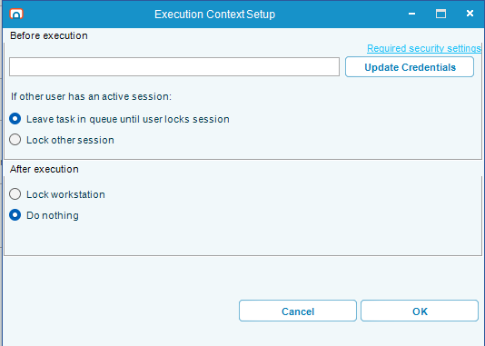
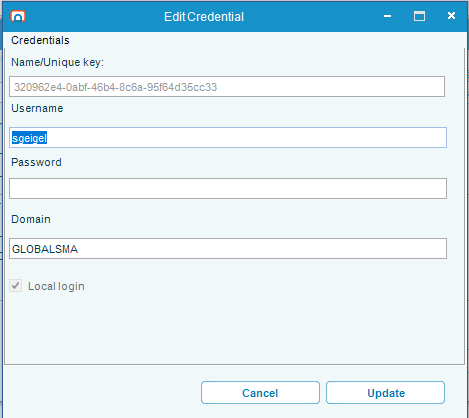
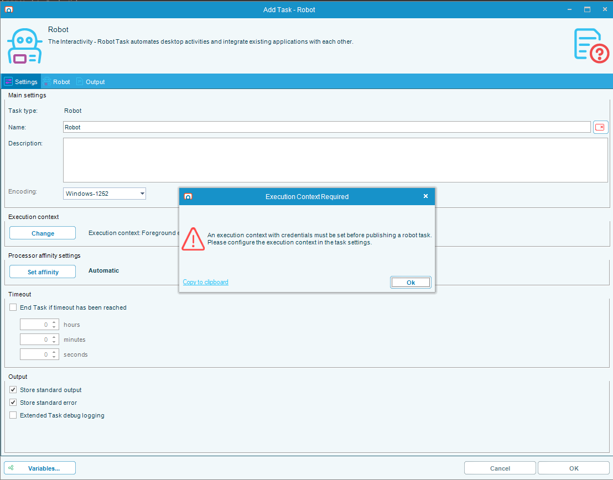
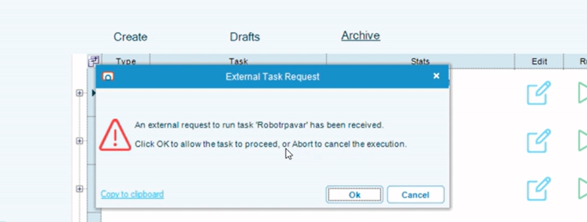
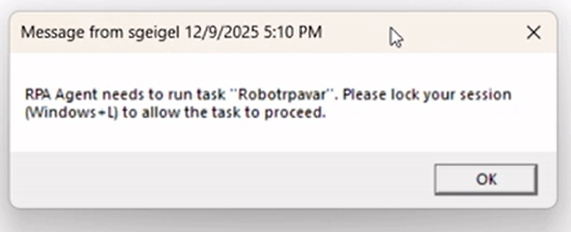
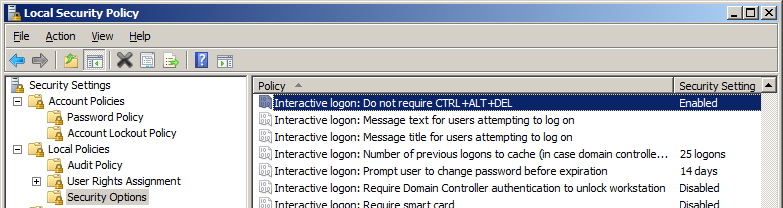
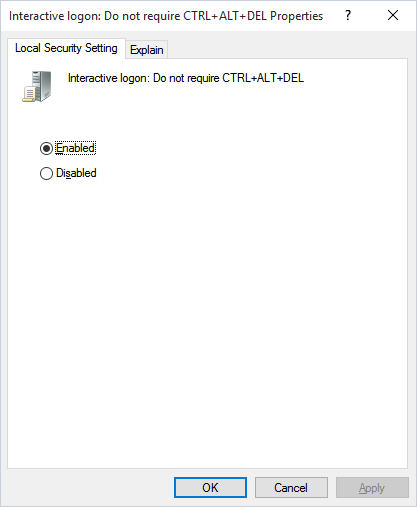
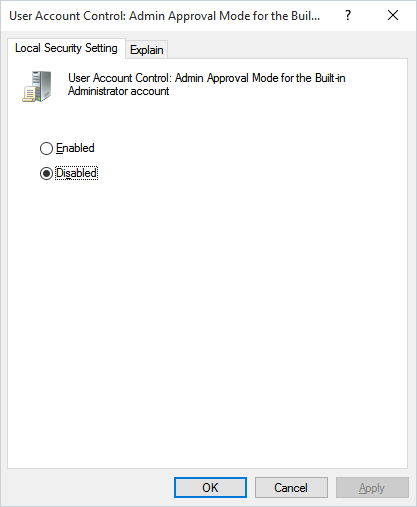

# Execution Context

Execution context specifies what user a Robot task should execute under. This configuration determines how the system handles user sessions and workstation states during task execution.

## Before Execution

### User Assignment

The text box (positioned to the left of the "Update Credentials" button) displays the user assigned to this task. This field specifies which user account the Robot task will execute under.

- If no user is currently assigned, the field will be empty
- The user can be set or updated by clicking the **Update Credentials** button

### Update Credentials

**Note:** The image above shows the full Execution Context Setup dialog. The "Update Credentials" button is located in the "Before execution" section.

Clicking the **Update Credentials** button allows you to set the task's execution user. When you update the credentials, it will set the execution user to your own user account (e.g., `mydomain\fredjohnson`).

:::caution Required Before Publishing
Before version 1 of a Robot task can be published, you must click the **Update Credentials** button to set the execution user. Once set, the execution context will remain the same unless a different user clicks **Update Credentials** and saves the task.

:::

:::tip Required Security Settings
For information about configuring security settings to address automation blockers in the Windows login screen, refer to the legacy documentation on interactive logon settings.
:::

## If Other User Has an Active Session

This section determines how the system should handle situations where another user has an active session on the workstation.

### Leave Task in Queue Until User Locks Session

When this option is selected, the task will wait in the queue and prompt the active user before proceeding:

- **If the active session is the target execution user:** RPA will present a message that a task execution has been requested and prompt the user to click **OK** to allow it to continue.

- **If the active session is a different user:** A Windows system message dialog will appear prompting the active user to finish what they are doing and press **Win+L** to lock their session. This allows the agent service to switch sessions to the target execution user.

### Lock Other Session

When this option is selected:
- **No prompt will occur** - the system will take immediate action without user interaction
- **If the active session is the target execution user:** The task will start executing immediately
- **If the active session is a different user:** The current session will be locked forcibly without user consent, allowing the agent service to switch to the target execution user
- This option is recommended for most users that aren't running automation on a workstation
- Best suited for scenarios where automation runs on dedicated machines or when user interaction is not expected

## After Execution

This section controls the workstation's state immediately after the task completes execution.

### Lock Workstation

When this option is selected:
- The computer will be locked immediately after the task finishes
- This is the most secure option, ensuring that the session is not left accessible
- Recommended for environments where security is a primary concern

### Do Nothing

When this option is selected:
- The session remains unlocked under the execution context user
- This option may offer slight performance benefits if multiple tasks will run consecutively under the same user
- The session will remain accessible until manually locked or the user logs out

## Edit Credentials Screen

The Edit Credentials dialog allows you to configure and update the credentials for the execution context user.

### Credential Fields

**Name/Unique key:**
- A read-only identifier (GUID) that uniquely identifies the credential
- This field cannot be modified

**Username:**
- Automatically filled with the username
- This field is read-only and cannot be changed

**Domain:**
- Automatically filled with the domain name (e.g., `GLOBALSMA`)
- This field is read-only and cannot be changed

**Password:**
- This field can be typed to add or update a password for the user
- The password will be encrypted and saved for later use
- After confirming the dialog, the password will be validated to ensure it is correct

### Additional Settings

**Local login:**
- This checkbox setting is present but will be ignored
- Local login is required for executing users and cannot be disabled

**Load user profile:**
- This setting (not visible in the screenshot) will also be ignored
- Loading the user profile is required for executing users

:::caution Required Settings
The "Local login" and "Load user profile" settings are required for executing users and cannot be disabled, even if they appear as configurable options in the interface.
:::

## Security Configuration

### Windows Security Settings for Execution Context

:::note System Requirements
OpCon RPA supports Windows 10 and later operating systems. The following security settings are required to enable "Foreground execution" for automation processes using the Credential Provider.
:::

#### Navigation:  
**Security > Interactive logon**

---

##### 1. Interactive logon: Do not require CTRL+ALT+DEL

To allow interactive logon for automation, you must disable the Secure Attention Sequence (SAS). This is done via:

**Administrative Tools → Local Security Policy → Local Policies → Security Options**

Locate and enable the setting: **"Interactive logon: Do not require CTRL+ALT+DEL"**.

This setting determines if CTRL+ALT+DEL must be pressed before a user logs on.  
- When **enabled**, users are *not* required to press CTRL+ALT+DEL to log on.  
- When **disabled**, users *must* press CTRL+ALT+DEL to initiate logon.

**Note:**  
- Not requiring CTRL+ALT+DEL may increase security risk, but it is necessary for automated foreground logins.
- On Windows 10 and later, this setting is typically **enabled** by default for both domain and standalone computers.

---

##### 2. User Account Control: Admin Approval Mode for the Built-in Administrator account

To allow automation to communicate with the Credential Provider, you must **disable** Admin Approval Mode for the built-in Administrator account:

**Administrative Tools → Local Security Policy → Local Policies → Security Options**

Locate: **"User Account Control: Use Admin Approval Mode for the built-in Administrator account"** and set this to **Disabled**.

- **Enabled:** The built-in Administrator account uses Admin Approval Mode, requiring user consent for privileged actions.
- **Disabled (Default):** The account runs all applications with full administrative privileges.

**After changing this setting, you must reboot the computer for the change to take effect.**

---

