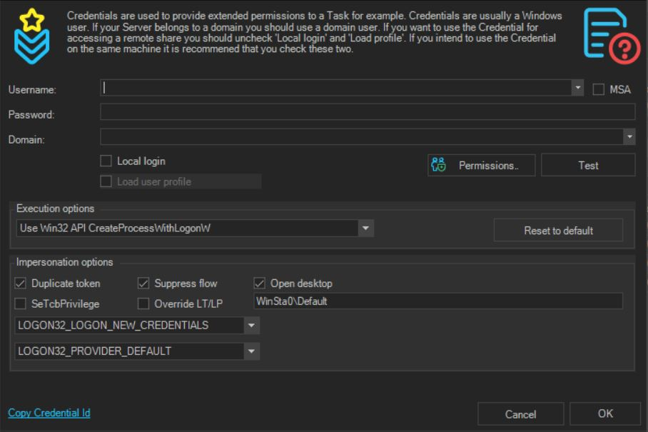
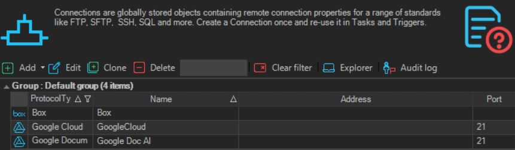
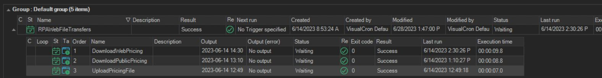
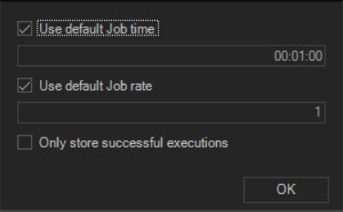
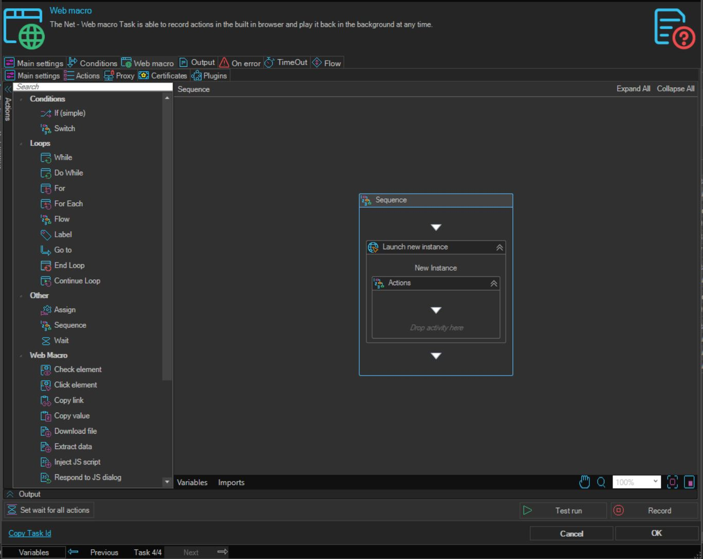
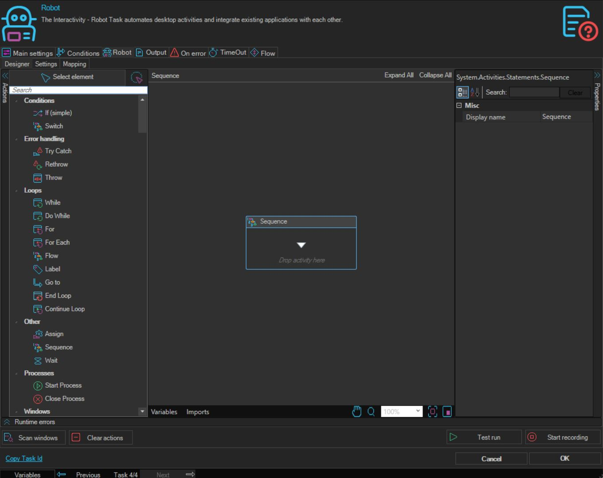
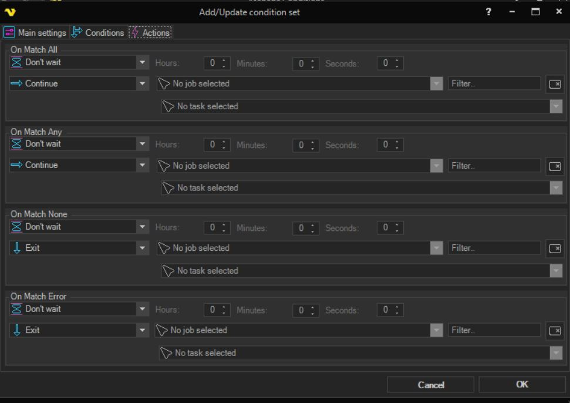
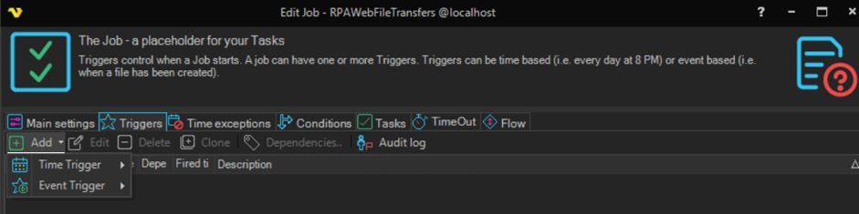

# RPA Job Configuration with VisualCron

## What is it?

This page walks through configuring an RPA workflow in VisualCron from a fresh install to a job that runs on a schedule. The procedure has three steps:

1. Set up authentication (Credentials and Connections).
2. Create the Job and add one or more RPA Tasks.
3. (Optional) Add Conditions or Triggers.

The objects you create fit together like this:

```
Trigger ──▶ Condition ──▶ Job ──▶ Task ──▶ Notification
                                  │
                          uses Credentials and Connections
```

For a high-level overview of these objects and how they map to OpCon, see [Configuration Overview](./overview-visualcron-rpa.md).

## Before you begin

You need:

- VisualCron Server and Client installed and the license activated. See [Installation - VisualCron Server & Client](./installation-visualcron-rpa.md).
- Permission to open the VisualCron Client and edit Jobs, Tasks, Credentials, and Connections.
- For desktop or hybrid Robot tasks: full control of the host system on which VisualCron is installed.

## Step 1 — Set up authentication

VisualCron uses two object types to authenticate to the systems your tasks reach. Both are reusable across Jobs and Tasks.

| Object | Purpose | When to use |
|--------|---------|-------------|
| **Credential** | A stored set of authentication details (system or user). | Whenever a Job or Task needs to authenticate as a specific user or system. |
| **Connection** | A reusable connection definition VisualCron uses to reach an external system. | Whenever multiple Jobs or Tasks need to reach the same external system. |

### 1a. Open the Credentials view



To open the Credentials view, complete the following steps:

1. From the server settings menu, select **Credentials**.
2. Add or edit Credential entries as needed.

### 1b. Open the Connections view



To open the Connections view, complete the following steps:

1. From the server settings menu, select **Connections**.
2. Add or edit Connection entries as needed. These can be reused across Jobs and Tasks.

## Step 2 — Create a Job and add Tasks

A VisualCron **Job** groups one or more **Tasks** that achieve a desired workflow.

### 2a. Create the Job



To create a new RPA Job, complete the following steps:

1. Right-click in the Job Group view and select **Add Job** from the menu.

:::tip Confirm ROI values when creating a new Job



ROI value is captured at the Job level. Update and configure your default ROI settings during Job creation to start capturing history.

The unit value is based on the currency configured in **Server** > **ROI settings**. See [Where to update default ROI values](./reporting-and-metrics-visualcron-rpa.md#measure-and-track-roi-for-rpa-tasks).

- **Job rate** represents savings in *ex. USD* per hour for all tasks assigned to the Job.
- **Job time** represents savings in time *ex. minutes* for all tasks assigned to the Job.

:::

### 2b. Choose a task type

The two RPA task types differ in what they automate and where they can run.

| Task type | Automates | Background / parallel | Host requirements |
|-----------|-----------|-----------------------|-------------------|
| **Web Macro** | Web-based processes recorded against a web browser. | Yes — supports background replay of multiple tasks in parallel. | The host that records the task. |
| **Robot** | Windows desktop or hybrid (web + desktop) processes. | No — requires full control of the host system. | The host that records the task; cannot replay on a remote virtual machine. |

:::caution Robot task host limitations
- The Robot recorder takes full control of the host system in order to run the workflow.
- A dedicated machine is preferred for running playback of Robot tasks, to ensure sufficient resources are available and that recording and playback do not interfere with other critical operations.
- Robot tasks only support recording workflow on the host system on which VisualCron is installed. The recorder does not currently support replaying workflow recorded on a remote virtual machine.
:::

### 2c. Add a Web Macro task (web-based processes)



To add a Web Macro task, complete the following steps:

1. Right-click the RPA Job and select **Add Task** > **Net** > **Web Macro**.
2. Record the manual web steps you want to automate.

### 2d. Add a Robot task (desktop or hybrid processes)



To add a Robot task, complete the following steps:

1. Right-click the RPA Job and select **Add Task** > **Interactivity** > **Robot**.
2. Record the desktop or hybrid steps you want to automate.

## Step 3 — (Optional) Add Conditions or Triggers

Conditions and Triggers gate or start a Job. Both are optional.

| Object | What it does | Configured on |
|--------|--------------|---------------|
| **Condition** | Evaluates a check before a Job or Task starts. The Job or Task only runs if the condition is satisfied. | A Job or a specific Task. |
| **Trigger** | Starts a Job by time or by event. | A Job. |

### 3a. Configure a Job or Task Condition



To configure a Condition for an RPA Job or Task, complete the following steps:

1. Right-click the RPA Job or Task and select **Edit**.
2. Go to the **Condition** tab.
3. Configure the conditional status requirement that must be met before the Job or Task runs.

### 3b. Configure a Job Trigger



To configure a Job Trigger, complete the following steps:

1. From the **Edit Job** view, select the **Triggers** tab.
2. Add a time or event trigger.

*Shortcut:* right-click an RPA Job and select **Triggers** from the menu to add a trigger directly.

## Where to go next

- To start RPA Jobs from OpCon (frequency, dependency, Self Service), see [Orchestration with OpCon](./orchestration-with-opcon-visualcron-rpa.md).
- To monitor running Jobs, view audit history, and check ROI, see [Reporting and Metrics](./reporting-and-metrics-visualcron-rpa.md) and [Troubleshooting](./troubleshooting-visualcron-rpa.md).

:::tip Ways to start an RPA Job
- On specific days of the week and/or times of the day.
- After a previous Job's condition or status is fulfilled.
- From a Self Service button for authorized users to run on demand.
- From file activity, using an MFT Server cloud trigger or a file-arrival Job dependency. [Learn more about OpCon MFT Server Triggers.](https://help.smatechnologies.com/opcon/agents/opconmft/server-triggers)
- From an OpCon event triggered by another process.
- From a variable trigger in VisualCron.
:::

:::tip Ideas for what to automate
- Upload and download web-based files, or run manual file movements.
- Copy, parse, and store data from a file or web page into a variable.
- Copy, parse, and store data from a file or web-page table into a file *(for example, Excel)*.
- Run a task in a Windows-based application.
- Run Windows system or local server tasks *(for example, core business Windows tasks)*.
- Run a task in a web-browser-based application *(for example, update customer and employee information)*.
:::

## FAQs

**Where do I configure ROI for an RPA Job?**
ROI is configured at the Job level. The unit value is based on the currency configured in **Server** > **ROI settings**. Update default ROI settings during Job creation to start capturing history.

**Which task type should I use for a web-based process?**
Use the **Web Macro** task type. It runs in the background and supports replay of multiple tasks in parallel.

**Which task type should I use for a desktop or hybrid process?**
Use the **Robot** task type. It requires full control of the host system on which VisualCron is installed.

**Can the Robot recorder replay workflow recorded on a remote virtual machine?**
No. The Robot recorder does not currently support replaying workflow recorded on a remote virtual machine.

**Are Credentials and Connections shared across Jobs?**
Yes. Both are reusable definitions you can attach to multiple Jobs and Tasks.

**Are Conditions and Triggers required?**
No. Both are optional. A Job can run without a Condition (no gating check) and can be started manually or from OpCon without a Trigger defined in VisualCron.

## Glossary

| Term | Definition |
|------|-----------|
| Credentials (VisualCron) | A stored set of authentication details used by VisualCron Jobs and Tasks. |
| Connection (VisualCron) | A reusable connection definition used by VisualCron Jobs and Tasks. |
| Job (VisualCron) | A grouping of one or more Tasks. Equivalent to an OpCon Schedule. |
| Task (VisualCron) | A specific process to run. Equivalent to an OpCon Job. |
| Web Macro | A VisualCron RPA task type for automating web-based processes; supports background and parallel replay. |
| Robot task | A VisualCron RPA task type for automating Windows desktop or hybrid processes; requires full control of the host. |
| Trigger | A time- or event-based condition that fires a VisualCron Job to run. |
| Condition | A check evaluated before a VisualCron Job or Task runs. |
| ROI | Return on Investment values captured at the Job level, expressed as Job rate (cost per hour) and Job time (minutes). |
