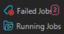
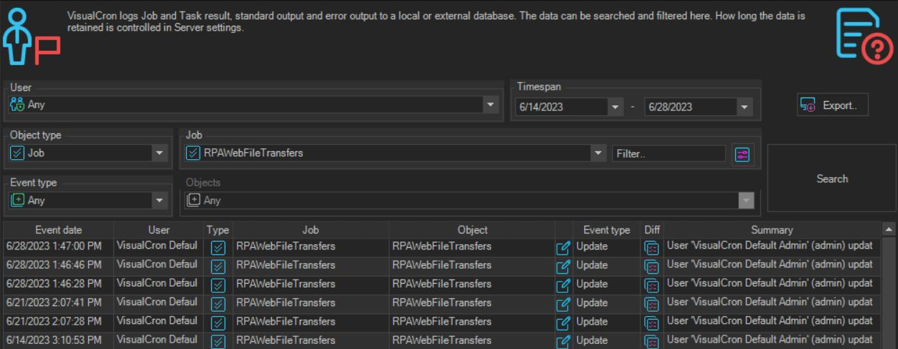

# Troubleshooting

## What is it?

This page describes where to find VisualCron RPA job and task status, audit history, and log history, and documents the known limitations of the RPA desktop recorder.

## RPA job and task status & results

:::tip Operational Status

For quick access to a summary of active jobs or recent job failures, go to the failed jobs or running jobs view on the server settings tab.

:::

### Audit history

## RPA job logs

To access job or task log history, right-click the job or task and select **log history** from the menu.

- Settings for debug log entries are found in the main menu **Manage** > **Manage server settings** > **Log settings** tab.
- Additional debug and log information is available for the server and log function.

## Known limitations

- The RPA desktop recorder takes full control of the host system in order to run the workflow.
  - A dedicated machine is preferred for running the playback of desktop RPA tasks, to ensure sufficient resources are available and that the recording and playback of tasks do not interfere with the management of other critical operations.

- RPA desktop tasks can only support recording workflow on the host system on which VisualCron is installed.
  - The RPA desktop recorder does not currently support the ability to replay workflow recorded on a remote virtual machine.

## FAQs

**Where do I see active jobs or recent job failures?**
Go to the failed jobs or running jobs view on the server settings tab.

**Where do I view the log history for a job or task?**
Right-click the job or task and select **log history** from the menu.

**Where do I configure debug log entries?**
In the main menu, go to **Manage** > **Manage server settings** > **Log settings** tab.

**Can I record on one host and replay on a remote virtual machine?**
No. The RPA desktop recorder does not currently support replaying workflow recorded on a remote virtual machine.
