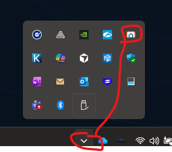

# Update - OpCon RPA

## What is it?

This page describes how to update an existing OpCon RPA installation. Updates have five steps:

1. Read the update considerations for the version you are moving to.
2. Stop the RPA Agent service and the Tray Client.
3. (Optional) Back up your settings.
4. Run the RPA Agent installer (and update the ACS plugin, if your version requires it).
5. Verify the service and Tray Client are running, then apply any version-specific post-update tasks.

This page assumes the RPA Agent and (for cloud installations) Netcom Relay are already installed. If they are not, follow [Installation - OpCon RPA Agent and Netcom Relay](./installation-opcon-rpa.md) instead.

## Before you begin

You need:

| Item | Where to get it |
|------|-----------------|
| `RPAAgent_x.y.z.msi` | [OpCon Web Installer (OWI)](https://github.com/smatechnologies/opcon-web-installer/releases) — **Agents** section |
| `sma.acs.OpConRPA.dll` (only if your version requires an ACS plugin update — see considerations below) | [OpCon Web Installer (OWI)](https://github.com/smatechnologies/opcon-web-installer/releases) — **Integrations** section |
| Local administrator rights on the Windows host | — |

## Update considerations

Read the entry for the version you are updating to **before** running the installer. Each entry tells you whether the ACS plugin must be updated and whether any post-update work is required.

### 1.0.2

| Topic | What to know |
|-------|-------------|
| ACS plugin update | **Not required.** No update was made to the ACS plugin in this version. |
| Network Credentials | This version fixed a bug where passwords for Network Credentials were not being saved. Update the password on every existing Network Credential before using it with an Execution Context, even if you were not using it before. Passwords are encrypted with the Windows Data Protection API. |
| Robot tasks | This version made an Execution Context required for all Robot tasks. Any existing Robot task must be saved and published again with an Execution Context defined. See [Execution Context](./robot-task-rpa.md#execution-context). |
| Impact on existing tasks | Running existing Robot tasks results in job failures until each task has been saved and published with an Execution Context. |

### 1.0.1

| Topic | What to know |
|-------|-------------|
| ACS plugin update | **Required.** This update is needed to receive a bug fix where Agent status showed as available even when the Tray Client was not actually running. |

## Step 1 — Stop the RPA Agent service and Tray Client

Do this step every time you update, before running the installer.

To stop the RPA Agent service and Tray Client, complete the following steps:

1. **Stop the RPA Agent service:**
   1. Press the Windows key.
   2. Type `services.msc` and press Enter.
   3. In the list, find **OpCon RPA Agent** (or **RPA Agent**).
   4. Right-click the service and select **Stop**.
2. **Close the Tray Client:**
   1. Exit the RPA Tray Client completely.
   2. Confirm it is not just minimized to the system tray (the area near the clock in the bottom-right corner). If you see the RPA entry there, right-click it and select **Exit** or **Close**.

## Step 2 — (Optional) Back up your settings

Backup is optional but recommended.

To back up your RPA Agent settings, complete the following steps:

1. Open File Explorer, type or paste `C:\Program Files\RPAAgent` into the address bar, and press Enter.
2. Right-click **appsettings.json** and select **Copy**. Paste the copy into a safe folder, such as your Desktop or Documents.
3. Copy the entire **DataCache** folder to the same safe location. Optionally, right-click the DataCache folder and select **Send to** > **Compressed (zipped) folder** to create a zip file.

## Step 3 — Update the ACS plugin (only if required)

If the considerations for your version say the ACS plugin update is **required**, replace the ACS Plugin DLL in your OpCon plugins directory using the same procedure as a new install.

See [Step 4 of the installation procedure](./installation-opcon-rpa.md) — copy the new `sma.acs.OpConRPA.dll` into the plugins directory, overwriting the existing file.

If the considerations say the plugin update is **not required**, skip this step.

## Step 4 — Run the RPA Agent installer

The RPA Agent Installer is named `RPAAgent_x.y.z.msi` (`x.y.z` is the version number). After downloading from OWI, the installer is usually in your **Downloads** folder. Open File Explorer and select **Downloads** on the left, or check your browser's download list.

To run the update, complete the following steps:

1. Double-click the `.msi` file.
2. When Windows asks "Do you want to allow this app to make changes to your device?", select **Yes**.
3. Wait for the installer to complete. The installer may restart the Tray Client automatically.

## Step 5 — Verify the service and Tray Client are running

After the installer finishes, confirm that both the RPA Agent service and the Tray Client are running.

### 5a. Verify and start the RPA Agent service

To verify and start the RPA Agent service, complete the following steps:

1. Press the Windows key.
2. Type `services.msc` and press Enter.
3. In the list, find **OpCon RPA Agent** (or **RPA Agent**).
4. Check the **Status** column. It should say **Running**.
5. If it does not say Running, right-click the service and select **Start**.

### 5b. Verify and start the Tray Client

To verify and start the Tray Client, complete the following steps:

1. Look for the RPA entry in the system tray (near the clock in the bottom-right corner). If you see it, the Tray Client is already running.
2. If you do not see the RPA entry:
   1. Press the Windows key.
   2. Type **OpCon RPA** (or the name of your RPA application).
   3. Select it from the Start menu. You can also look under **Start** > **All Apps** for the OpCon RPA entry.
3. After the Tray Client is open, you can minimize it to the tray. The Agent is then active and ready for use.

## Step 6 — Apply post-update tasks for your version

After the service and Tray Client are running, apply any version-specific tasks listed in the [update considerations](#update-considerations) for the version you just installed.

For example, if you updated to 1.0.2:

- Update the password on every existing Network Credential before using it with an Execution Context.
- Save and publish every existing Robot task with an Execution Context defined. Until you do this, running those tasks results in job failures.

## FAQs

**Do I need to update the ACS plugin every time I update OpCon RPA?**
No. Check the update considerations for the version you are installing. Version 1.0.1 required an ACS plugin update; version 1.0.2 did not.

**How do I update the ACS plugin?**
Replace `sma.acs.OpConRPA.dll` in your OpCon plugins directory with the new copy from OWI. The procedure is the same as a new install — see [Step 4 of the installation procedure](./installation-opcon-rpa.md).

**Why are my existing Network Credentials not working after updating to 1.0.2?**
Version 1.0.2 fixed a bug where passwords for Network Credentials were not being saved. After updating, update the password on every Network Credential before using it with an Execution Context.

**Why are my existing Robot tasks failing after updating to 1.0.2?**
Version 1.0.2 made Execution Context required for all Robot tasks. Save and publish each existing Robot task with an Execution Context defined.

**Should I back up my settings before updating?**
Backup is optional. To back up settings, copy `appsettings.json` and the `DataCache` folder from `C:\Program Files\RPAAgent` to a safe location.

**Where do I download the installer and ACS plugin?**
Use the [OpCon Web Installer (OWI)](https://github.com/smatechnologies/opcon-web-installer/releases). The RPA Agent Installer is in the **Agents** section; the ACS Plugin DLL is in the **Integrations** section.

## Glossary

| Term | Definition |
|------|-----------|
| RPA Agent | The agent that performs robot task automation on a target Windows machine. |
| RPA Tray Client | The local Windows interface that runs alongside the RPA Agent, used to configure the OpCon API connection and tokens. |
| ACS Plugin DLL | The OpCon Application Connection Studio plugin file (`sma.acs.OpConRPA.dll`) that lets the OpCon SAM communicate with the RPA Agent. |
| Network Credential | A stored credential in the RPA Agent used by Robot tasks. Encrypted with the Windows Data Protection API. |
| Execution Context | The configured rules for how a Robot Task interacts with the machine before and after it runs. Required for all Robot tasks starting in 1.0.2. |
| OpCon Web Installer (OWI) | A tool that bundles OpCon installer artifacts, including the ACS Plugin DLL and the RPA Agent Installer. |
